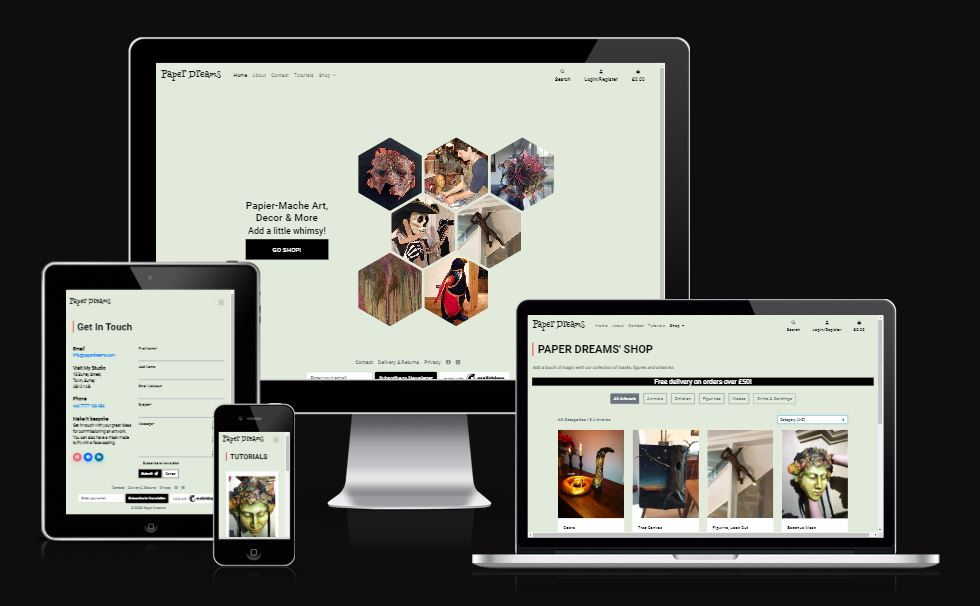
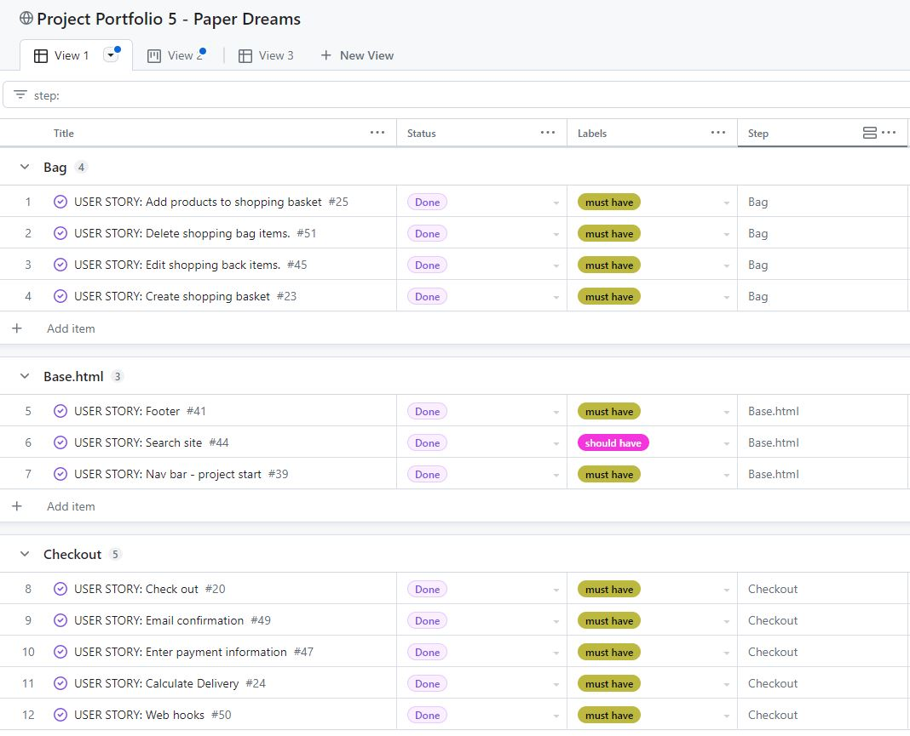
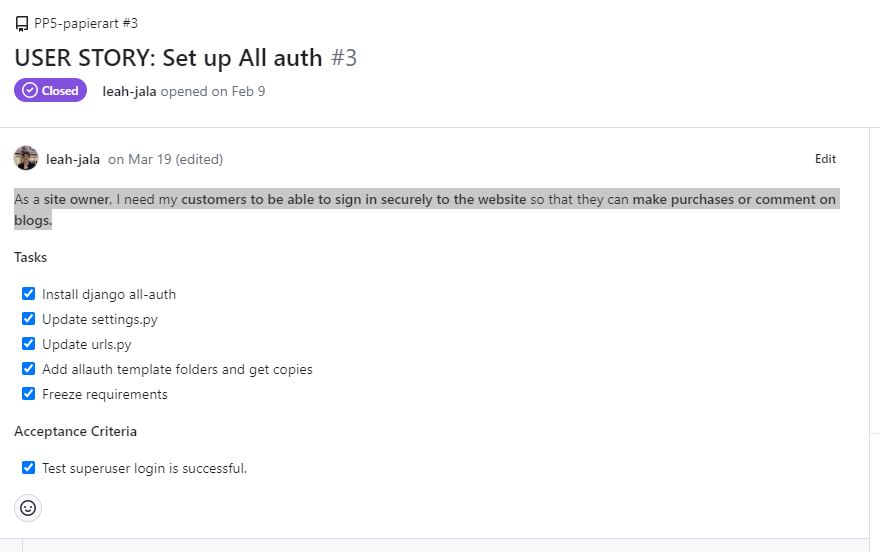
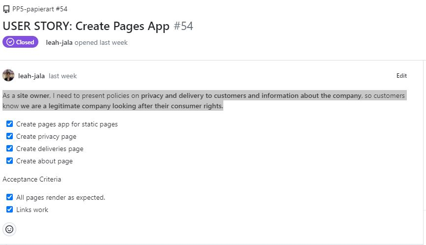
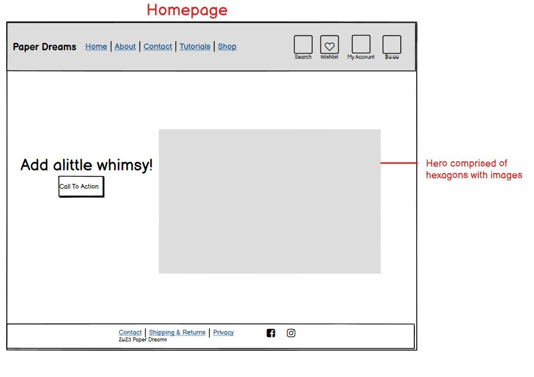
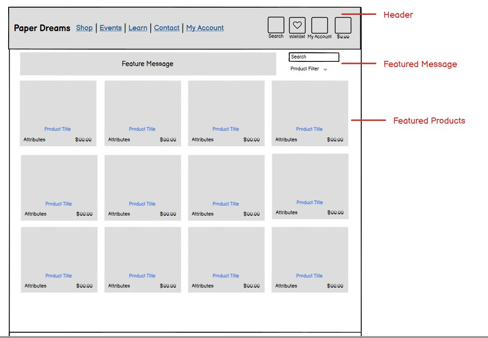
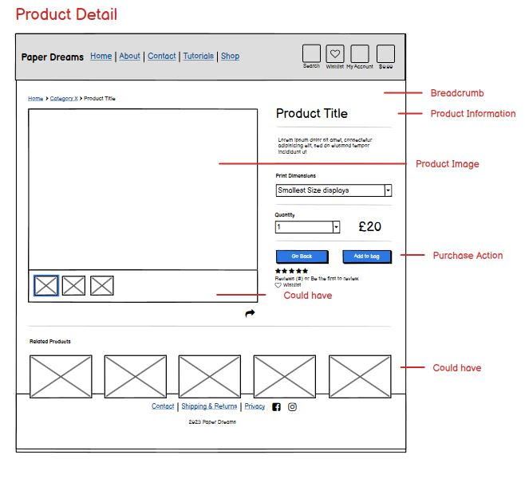
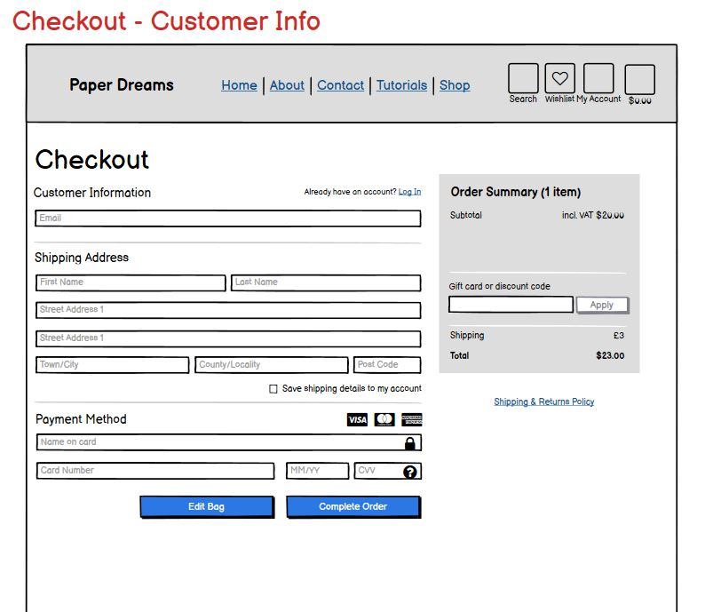
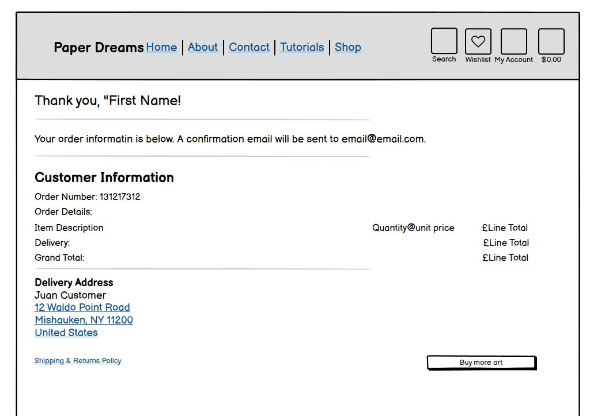
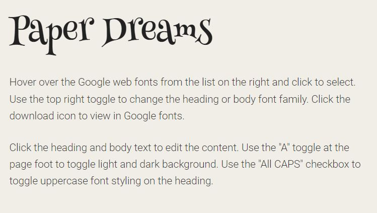

# Paper Dreams

This is a website for a fiction company called, "Paper Dreams," Code Institute Portfolio Project 5. The artwork presented on the site has been created by Leah Janss Lafond, with all rights reserved.

Paper Dreams is an ecommerce website for a paper-mache artist to sell a small collection of ever-changing masks, figurines and animal objects, paintings and prints and more. Customers can register with the site, which allows them to maintain an order history, a profile and a wishlist.

View the live site [here.](https://paper-dreams-uk.herokuapp.com/)

## Table of Contents
---
- [Purpose and Goals](#purpose-and-goals)
- [E-commerce Business Model](#e-commerce-business-model)
- [Marketing Goals](#marketing-goals)

# Purpose and Goals
This purpose of this website is to all the site owner to sell her artwork online. The artist would like to build a community of followers, which she aims to do by making tutorials available online and creating a complimentary space on Facebook.
## The audience
Paper Dreams' audience is matches the Etsy Community whose audience is described as largely females between the ages of 18-35. Etsy estimates 86% of their buyers are female. Like Etsy, the site owner expects the audience to be young, female and interested in unique, original items with vibrant colour palettes. Etsy describes the buyer's behaviour and trends of which the following apply to Paper Dreams:

They want to support small businesses. They use the hashtag #StandWithSmall. The site could also make use of this hashtag. Statusbrew lists some top trending small business hashtags. Top-Hashtags offers some useful ideas, moving away from the specific art scene to other interest areas of potential customers, such as #womanownedbusiness, #newbusiness, #supportsmallshops, #handcraftedgifts, #handmadecrafts, and #handcrafted"add item".

They want to make their homes more stylish with unique bright items.

The are interested in projects they can do from home. (Relates to tutorials/learn page)

The are looking for unique gifts for various occasions.

For the purpose of this marketing strategy, we want to think about our customer in narrow terms in order to be able to create useful keywords for the site and and overall marketing strategy.

- Age: broadly 20-35
- Gender: identifying as female
- Online hangouts: 
    - Most likely Instagram and Facebook users
    - Likey to check accounts through the day, but most likely present in the evenings
- Interests: 
    - Social responsibility
    - Sustainability
    - Enjoys browsing and shopping online
    - Listens to podcasts related to fashion, exercise, entrepreneurship, freelancing, cookery, health, lifestyle, goal-setting, mindfulness, and general well being
    - Reads blogs
    - Spending power
        - Likely to rent 
        - Decent income, but need to save and pay back loans
        - Likely to have a social life (no kids yet)
        - Up and coming in their careers, but will suffer if they become mothers.
    - Frustrations
        - Getting on the housing ladder
        - Progressing in career
        - Burnout at  work/instability in careers.
        - Lack of childcare options, if mothers
        - 
## Broad User Goals
- To find an browse available art.
- To buy papier mache art
- To learn the techniqes of mask-making and papier mache generally

## Broad Site Owner Goals
- To have an online point of sale for her artwork.
- To be able to display her work online
- To create a community of people interested in papier mache

## E-commerce Business Model
The site owner sells to individuals, making her business a Business-to-Customer (B2C) model. The customer makes a single payment and there are no subscriptions or regular fees. The business sells directly to the customer, without the involvement of any outside parties.

Given the above, and the target audience, the website should
- Cater to individuals, and impulse buys by making purchases easy with a smooth, quick checkout process
- The site should build customer confidence:
	- The customer should get confirmation that all is well by receiving a confirmation page and email. 
	- Customers who log in should be able to see their order history
	- Customers should not be obliged to create a profile. Many customers don't want to save their details.
	- The customer should easily be able to find shipping and returns information. 
	- The customer should easily be able to find a privacy policy.
	- The customer should easily be able to find contact information.
- Photos should be attractive, but they should also make
 clear these are handmade items by an individual.
- While the artist won't initially have much to display, the site should allow for product filtering by category.
- The site should have a search field so returning customers can find something they've seen before.
- The site should have a wishlist so customers can save items they are interested in and return to review them at a later time.
- The site owner wants the customer feel like they can get involved by trying a tutorial, or showing how they are displaying their artwork in their home.

## Marketing Strategy
The site owner is not interested in joining Etsy as she feels the platform is too crowded, and there is some suggestion it has declined. [TechPenny blames Etsy's algorithms](https://techpenny.com/typical-etsy-demographics-stats/) and the amount of time customers must spend on the platform only to get frustrated and leave after they don't find what they are looking form. By contrast, [Statista.com](https://www.statista.com/statistics/409375/etsy-active-buyers/) reported an 18% increase in sales. Reuter's reports Etsy has suffered related to [SVBs collapse with resulting delays processing sellers' payments](https://www.reuters.com/markets/etsy-other-e-commerce-companies-feel-squeeze-svb-collapse-2023-03-13/), with some sellers complaining Etsy lacked transparency. Notwithstanding these reports on the Etsy platform itself, there is a clear interest by consumers in handcrafted items created by small businesses. 

### Marketing Goals
The site owner will market through her Facebook Page, [Paper Dreams](https://www.facebook.com/profile.php?id=100091661127883). The idea is to build a community there by displaying work and creating a community by providing free tutorials online and encourage site users to post their progress and results on the Facebook page. The artist is a local artist and sells at local markets where she can prominently display the site link. The intention would to get a domain name matching the name of the business so it is memorable.

The marketing goals are to:

- Showcase the artist's work on the website. The ecommerce site has the double function of being a portfolio for this artist to show off the bredth of her work. In future, more can be done, for example by expanding the about page, to give information about the inspiration behind her work. Also, the tutorials page gives great insight into her techniquess.
- Build brand awareness through an online presence. On a real site much effort would be put into the creation and use of a logo, but I didn't have resources for this mock-project. However, the colour scheme and the style of the site creates a memorable aesthetic.
- Generating leads. Emails can be collected through the MailChimp newsletter signup and via the contact form opt-in to the newsletter. 
- Engaging customers and followers. The tutorials page and the Facebook page gives people reasons to keep coming back o the site and engaging directly with the artist.
- Driving sales with email marketing. The eventual newsletter can be used to let people know where she will be exhibiting work. Future features could include a blog page for the purpose of such announcements and news.

### SEO & Analytic

1. Keyword Search

    - General for site
        - Short-tail: sustainable crafts, handmade  masks, handcrafted gifts, handmade gifts, unique interiors, unique decorations, affordable art
        - Long-tail: unique sustainable gifts, handmade by Surrey artist, fun decorations to brighten the home, gifts to lift your spirits, one-of-a-kind affordable artworks
    - Papier mache masks:
        - Short-tail keywords: papier mache masks, masks for sale, handcrafted masks, 
        - Long-tail keywords: handcrafted papier mache masks, unique papier mache masks, papier mache masks for Halloween
    - Papier mache figures and animals:
        - Short-tail keywords: whimsical art, quirky art, decorative animals, colorful art, 3d art, wacky figurines, unique sculptures
        - Long-tail keywords: handcrafted papier mache animals, handmade children's room decor, fun decorations for children's rooms, one-of-a-kind sculptures
    - Pen & ink prints:
        - Short-tail keywords: pen and ink prints, prints for sale
        - Long-tail keywords: black and white pen and ink prints, pen and ink abstract prints, pen and ink art prints, abstract art therapy
    - Paintings:
        - Short-tail keywords: paintings for sale, art paintings
        - Long-tail keywords: watercolour paintings for sale, abstract mixed media paintings for sale, modern art paintings
    - Tutorials:
        - Short-tails keywords: mask tutorial, papier mache tutorial
        - Long-tail keywords: how to make a bespoke mask, mould-making tips for mask-making, choosing the right paper for your papier mache project, inexpensive art projects to do at home, cheap things to do with kids, cool projects to make with paper and glue

2. On page optimization

    If this were a genuine business, it would make sense for the artist to use her name as the domain name and then change the site title to Paper Dreams by "Artist Name". Factors taken into account include relevant headings, meta tags, optimizing images for faster loading, making sure the site is mobile friendly. 

3. Off-page optimization

    If this  were a real site, the business should seek to engage with other artists and website owners by writing guest blogs, or by asking them to link to this site for its resources (the tutorials blog), events or by reviewing our site and art works. An obvious place to start would be papiermache.co.uk which is a platfrom for papier mache artists. By posting there regularly, you quickly become part of a community and if you post projects there, your project will be the first or one of the first visitors to the site will see. Many of these artists have their own websites and community connections and are generous with help and advice.
    
4. Technical optimization

    - Page loads fast, images are converted to webp
    - Mobile friendly
    - Easy to navigate

5. Content

    - Text is highly relevant to page purpose. No superflous text.
    - Non commercial content aims to retain visitors/create repeat visitors
    
6. Meta tags

    The various pages on this site leave little room for SEO keywords as there are few titles and subtitles, howwever there is ample opportunity in the product descriptions.

    - Meta descriptions - I have put unique page descriptions on every content page: Homepage, Contact, Privacy, Delivery, Products and Tutorials. Google will not crawl through the pages that require user sign in. The meta tags needed to be placed in the extra_meta block as the presence of a tag in base.html would produces a duplication and error.

    - Meta keywords: I read [Google does not use the keywords meta tag in web ranking](https://developers.google.com/search/blog/2009/09/google-does-not-use-keywords-meta-tag) on "Google Search Central Blog" on  developers.google.com and have therefore not used them. I was surprised to see this information was presented in 2009.

7. Evidence of being a trusted site

    The project includes a privacy policy to meet GDPR rules. There is also a contact page, and a delivery and returns policy This  helps customoer confidence, and improve SEO.

## Website Design
### The Strategy Plane
The goals of the site are similar to that of Etsy and NotOnTheHighStreet. This site aims to offer users unique items to bring a bit of joy into their lives.  The site owner does not wish to have a profile on these sites, because they wish to display works not for sale as well as to provide tutorials. While the site will be online, and can be thought of as having a global reach, the site owner is also very much involved in the community, and wishes to have an exclusive site.

### Emotional Factors
It is the artist's hope that her artworks will help site visitors reimagine their surroundings. The site should be easy and intutive to navigate so as not to detract from the works themselves. An attractive website will add to the value of the work as the same care as creating the art will go into the presentation of it via the website. Even if the customer is not ready to buy, it is the hope of the site owner that the customer will like the experience of the site so much that they will return repeatedly to look and browse.  

The reviews page is also meant to be something of a community page where customers can leave their thoughts about their purchases and also upload photos to show how they are displaying the product at home or in their workplace. The idea is that it will inspire prospective customers, and encourage conversation. 

### User Stories & Project Management
On GitHub, user stories were defined as issues with tick-box tasks and acceptance criteria. 

Looking back at the project, I realize I did not write down enough of the fine detail that I can now see in other people's readme files. Also, for some of the user stories, I found it more efficient to break down the user story into a set of tasks within the user story. 

I should have created a separate level of developer stories. I did something like this for the project set-up, but didn't carry it through the rest of the apps. As I was sitting with a spreadsheet of general requirments, both based on the project requirement's as well as a to do list. It didn't occur to me to include as user stories something like adding a "Page Not Found" or a Procfile as a specific "user" story.  I could have been much more granular. I think this also comes from working alone as opposed to with a team among whom tasks are shared and a higher level of specifity is required. 

The project was developed using Agile Methodology as presented in Code Institute modules. User stories and milestones were created on GitHub's project boards. Each user story was defined and given a status including "must have" (for minimum viable product), "should have" (functionality that would make the site work better but isn't absolutely necessary to launch the site) and "could have" (features that would be nice to include). Some of these items were transitioned to "won't have" as the time demands demanded prioritization of the must and should haves. 

GitHub's Milestones were initially used for the project iterations, but I found them awkward to set up and created a similar categorie which I've called "steps" on the board. While we were encouraged to drag issues along a kanban board, I found it neater to organize my work on a .

The project board is at this [link](https://github.com/users/leah-jala/projects/8).

## The Scope Plane

Considering the goals above, the following requirements were identified.

### "Must have" - Minimum Requirements
- A homepage which gives an overview of the purpose of the site, a clear call to action (shop button) and information about who is behind it.
- An intuitive navigation bar and a footer that leads customers to all the information they need to get in touch, review shipping and returns policies and browse products.
- A cleanly presented products page with an image, title and price for each item.
- A product detail page
- Customers should receive success/confirmation messages when adding products and throughout the checkout process.
- A checkout page that can be used without registration.
- A checkout page that can be used as a signed in user. 
- A checkout page that allows the customer to save their shipping details to their profile.
- A checkout process with Stripe that is safe for customers.
- After payment there should be success messages on screen.
- After payment, the customer should receive a confirmation email, including an order number and the products ordered. 
- A registered customer must be able to access their order history.
- A contact page that allows customer to submit questions via a form. 
- A tutorials page for the artist to be able to present tutorials as a blog, with images.

### "Should have" - Intended Requirements
- The ability to add items to a wish list. 
- Customers should be able to leave a review, including photos. If there is not enough time, customers could be encouraged to do this on Facebook.
- It should be possible to search for reviews by item title.
- The reviews should be imported into the products page. For example, if an item has received reviews, there should be a link the reviews page, set that item's id. 

### "Could have" - Desired functionality that is not essential
- Site users should be able to comment on tutorials/blog entries and upload photos of their work. 
- Site users should be able to filter tutorials by title or theme (e.g. There might be more than one mask-making tutorial)
- An events page that allows the ower to use a form to enter information about upcoming events such as an exhibition or a course.

### User Stories

Project Set Up
- As a developer, I need to create a django project, so that I can build the site apps.
- As a developer, I want to deploy my project early, so that I can avoid problems later in the project. (In practice I did this closer to the end of the project.)
- As a site owner, I need my customers to be able to sign in securely to the website so that they can make purchases or comment on blogs. (This was an example of a user story where I have grouped together tasks)

- As a developer, I need to create a project level template, to contain the common elements of the site.
- As a site owner, I want an attractive homepage so that my site users wiill explore the site.

Base

Contact Page
- As a website visitor, I want to be able to fill out a form on the contact page to send a message to the website owner.
- As a website visitor, I want to be able to easily find the contact page so that I can get in touch with the website owner.
- As a website visitor, I would like a an email confirmation after I submit the contact form, so I can review the message I sent later.

Homepage
- As a developer, I need to set up a home app so I can build the index.html page.

Pages App
- As a site owner, I need to present policies on privacy and delivery to customers and information about the company, so customers know we are a legitimate company looking after their consumer rights.

Site wide
- As a site user I want to be able to search the website so I can find products I've looked at before.
- As a site owner, I want my customers to receive notifications to give them confirmation things are working.
- As a site user, I need a navbar to easily navigate the site and orient myself.
- As a site owner all the navbar links must work right so users can navigate my site.
- As a site user I want the site to have a footer so I know how to contact and stay in touch with the company.
- As a site owner I need to make sure my site can be found by search engines so I will have as much site traffic as possible.

Products
- As a site visitor, I want to search for products by keyword, so I can find items that match my interests quickly.
- As site user I want to be able to view the artwork by category so I can narrow down my selection
- As a site user, I need to be able to see a list of products so I can know the price and specific information such as size.
- As a site visitor, I want to view a list of products, so I can see the items available for purchase.

I should have included user stories here for Product Management.

Bag
- As a site user, I need to be able to add items I wish to purchase to a list, so I can see a summary of those items and the total cost.
- As a site user, I want to edit the shopping basket, so I can get the right quantity of each item.
- As a site user, I need to be able to add items I wish to purchase to a list, so I can see a summary of those items and the total cost.

Checkout
- As a site user, I want a simple checkout process so I can check out quickly and confidently.
- As a site user I want to be able to anonymously enter my payment information, so that I don't have to have a user account.
- As a site user, I want to receive an email confirmation/receipt, so that I have proof of purchase.
- As a site owner I need the the delivery charge to update automatically so "users are charged the correct amount".
- As a developer, I need to handle payments so our database is always up-to-date with payment confirmations.

Profiles
- As a site owner, I want users to be able to create a profile so they can view their order history and sign up for site information.
- As a site user, I want to be able to see my personal information, and review my orders, so I know what information the company holds.
- As a site user, I want to be be able to update my personal information so I my delivery and contact details are up to date.
- As a site user, I want to be able to go on my profile and see my order information.

Tutorials
- As a site user, I'd like a "how to section" of the website, so I can learn how to create my own artwork.
- As a superuser, I want a user friendly form to upload tutorials.
- As a Site owner I want to be about to edit my posts to make corrections, additions, etc.
- As a site owner, I want to be able to delete old posts when they are no longer needed.

Wishlist
- As a site user, I would like to be able to add and save items to a wishlist, so that I can can keep shopping and go back and review them later.
- As a site user I want to be able to remove an item from my wishlist when I am no longer interested.
- As a site user, I want to see if I have already added an item to my wishlist, so that I don't have to open the product detail page again.

### Contraints
The major constrainst is the timeline for completing the project. 

## The Structure Plane
### Planning
As this is an e-commerce site, the major objective is to sell artworks. The customer journey from the perspective of making a purchase is described below. The elements of the site related to tutorials have the objective of building advocacy for the company, enabling it to build a following and retain customer interest beyond the intitial point of sale.  

#### The Customer Journey

- **Discovery/Awareness:**  The customer is likely to hear about or find the website via word of mouth, search engines or social media. The site owner will not be buying advertising space.
    - User Action - asks a friend if they know any sites, uses keyword searches to find sites.
        - Emotion - initially curious. Happy.
        - Touch points - directly visit the site (word of mouth/recommendation), google result.
        - Consideration: Looks at multiple artworks before making a decision
    - User Action - Compares several sites
        - Touchpoints - homepage if given by friend, or directly landing on product page
- **Product detail page, or tutorials page** after Google search.
    - Emotions - If the site works as the user expects, they would be largely indifferent about the site itself, but if it requires too many clicks or if is hard to find what they are looking at they might get annoyed and leave the site.
    - Pain points:
        - Website is boring.
        - Website is difficult to navigate
        - Customer can be overwhelmed if there are too many clicks or steps to make it to purchase point.
        - Can't find an artwork they had already viewed.
        - Site loads slowly.
    - Solutions:
        - Navigation should be clear.
        - Photos and information on product page should be informative enough that the customer does not need to open every product detail page.
        - Product page should allow category filtering and a search field.
        - The inclusion of free information, like tutorials, and ways to get involved, for example exhibitions, should add interest and build a sense of community.
        - Create wishlist so user's can easily save items they are interested in to a list.
- **Selection and checkout**:
    - User actions: 
        - selects products, adds it to the bag, fills in form, enters card details, confirms payment.
    
    - Touch points:
        - **Products page**
        - **Products detail** page/Add to cart/bag
        - Go to secure checkout - brings you **shopping bag (summary) page**
        - Click secure checkout - brings to **checkout form**
        - **Log in** (if not already), or simply continute to payment field
        - Enter card detail into field - send to Stripe 
        - Adjust bag, or complete order
        - Get success, with order summary or failure message
        - Get confirmation email.
    - Emotions: 
        - Happy if the process is fast, smooth and takes little time to complete.
        - Happy if the user doesn't not have to sign in, and receives plenty of confirmation along the way so they are confident the site works and will be secure.
        - Happy if they can call upon shipping details already entered in the past and purchase quicker. 
        - Angry if faced with a lot of error messages, forms that are unclear, a payment field that is not clear about what cards it accepts.
    - Pain points;
        - Form is so restrictive that it is hard to get through it without a lot of errors.
        - Checkout doesn't support all card types.
    - Solutions:
        - Clarify with symbols which cards are accepted.
- **Delivery**:
    - User Action: Customer receives item.
    - Pain Points: 
        - Item not delivered quickly.
        - Item damaged.
    - Solutions:
        - Provide clear shipping and returns policies/information. 
        - Provide clear returns policy
        - Make footer sticky so returns and shipping policy always visiable.
        - Provide contact page to make it easy for customer to report problems.
- **Advocacy via Facebook page**: 
    - User Action
        - Leaves a great comment on facebook page.
        - Leaves a bad comment on facebook page if experience is bad.
        - Gives a poor review if customer service is poor following delivery problems, or unanswered questions. 
        - Recommends tutorials and exhibitions to friends interested in art. Links through to their own page
    - Touchpoints:
        - Contact page
        - Facebook page
    - Painpoints as mentioned above in user actions section.
    - Solutions:
        - Include shipping tracking field in custom model and trigger an email when product is marked as fulfilled.
        - Make it easy to share products
        - Post tutorials frequently, giving customers a reason to keep returning to the site for interesting activities and learning should create advocates for the website and company.

## The Skeleton Plane

### Large Screen Wireframes
The homepage should look artsy and not like a commercial site. It should appeal to those looking for something unique and handmade.

There is a benefit of the products pages being familiar/universal. I believe it gives confidence that owner has invested in professional web development, with the expected site security.

The checkout pages are very similar to what users would expect. I had hoped to make the checkout pages a bit more sophisticated but in practice didn't have time. 

## The Surface Plane

### Branding
The branding on this mock site is acheived mainly through a colour palette. I did not have resources to create a professional logo. This would obviously be important and then used on email headers, throughout the site and on facebook pages and another other communication off the website.
#### Fonts
As many of the items on the site are fun and aim to add a bit of spice and fun into people's environment, the site user wanted a font that reflected this. The site name/logo will uses Henny Penny, 

#### Colour palette
I took some inspiration from the 2016 and 2017 [W3 Schools color palettes](https://www.w3schools.com/colors/colors_palettes.asp), however in the end choose my own combination of colors. 
- Fonts/Text - black
- Header highlights/Button hover: #dc3545
- Background: #e2ebdb

I wanted colors that were unique and artsy, but not a distraction to the artwork itself. The small highlights to the page add a bit of interest without being overwhelming or distracting. 

### Interaction
### Accessibility
Effort has been taking to create a site with color contrast, semantic html for compatibility with assistive technologys and the ability to logically tab through a site, the use of aria-lables and image alts.

## Site Features

### Navbar
- The navbar contains the website name, and links to all pages on the site, apart from those related to the checkout once you only see once completing a transaction.
- Website name is a link that brings users back to the homepage.
- Nav bar collapses on small screens.
- Home: returns users to the homepage
- About: brings users to a page about the company.
- Contact: brings user's to a contact form.
- Tutorials: Takes users to a list of available tutorials. There is at present only one.
- Shop: A dropdown menu allowing users to go to a page with all artwork, or to go to one of the categories.
- Search: This allows customers to search products. As this is an art website and will never have 100s of artworks for sale, it is not as vital as it would be for a larger store in the sense that the field should be ever present. I have offered the functionality as an icon and popup form. 
- Wishlist for signed in users. 
    - If nothing is on the wishlist the heart is an outline
    - If a product is on the wishlist, the heart displays read
- Wishlist icon does not display for user's who are not signed in
-Login/Register - This displays in the navbar for unauthenticated users. The dropdown options are to Register or login
- My Account- if the user is logged in and not a superuser of staff member, they will see
    - My Profile
    - Logout
    if the authenticated user is a staff member, they will additioanlly see
    - Tutorials Management
    if the authenticated user is a superuser, they will additionally see
    - Admin: link to admin panel
    - Product Management

### Footer
- Link to contact page
- Link to delivery and returns page
- Link to privacy policy page
- Social media links
- Mail Chimp sign up form 

### Homepage
### About Page
### Tutorials 
### Tutorials Management
### Shop
### Products Management
### Search Utility
### Wishlist
### My Profile
### Shopping Bag
### Checkout
### MailChimp Newsletter
### Delivery and Returns
### Privacy

## Future features
- Search field should be altered for fuzzy logic.
- Checkout page: If a form is filled in when the user sees the link towards the bottom it should keep the information through the login.

## Installed packages
This project was built with Python3 and Django 3.2. The following packages were installed.
Use pip install + app name, then add to settings. 

- [boto3](https://django-storages.readthedocs.io/en/latest/backends/amazon-S3.html) - Supports Amazon web services
- [ckeditor](https://django-ckeditor.readthedocs.io/en/latest/) - Provides richtext fields, WYSIWYG editing and image management. 
- [django3.2](https://docs.djangoproject.com/en/dev/releases/3.2/) - a LTS version of django offering stability and security.
- [django-allauth](https://django-allauth.readthedocs.io/en/latest/installation.html) - Handles authentication and site registration
- django-countries - A Django library that provides a comprehensive list of countries for use in your application.
- django-crispy-forms - A Django utility that helps create attractive forms with minimal coding.
- gunicorn - A Python WSGI HTTP server that allows you to run Django applications.
-[Pillow](https://pypi.org/project/Pillow/) - A python library for working with digital images
- oauthlib (Allauth)- A Python library that provides a set of OAuth and OAuth2 client and server tools.
- [Stripe](https://docs.dj-stripe.dev/en/master/) - Python library to create an interface with the Stripe payment platform.

## Technologies and resources

Planning and resources
- [Markdown Cheat Sheet](https://www.markdownguide.org/cheat-sheet/)
- Lucid Charts
- Balsamiq Wireframes

Fonts and Icons
- [Google Fonts](https://fonts.google.com/)
- [Font Pairing, by Our Own Thing](http://www.ourownthing.co.uk/fontpairing/)
- Favicon.io
- Font Awesome

Images
- Cloud convert

Version Control and editor
- GitHub
- GitPod

Languages
- HTML
- CSS
- Bootstrap
- Javascript
- Python
- Django
    - Crispy Forms
    - Pillow

SEO/Site maps
- [Online sitemap generator](https://www.xml-sitemaps.com/)
- [Wordtracker](https://www.wordtracker.com/) - USER FREE TRIAL!
- [https://search.google.com/search-console/about](Register sitemap)

Deployment resources
- Heroku
- ElephantSQL

Language Validators and format helpers
- W3C Markup Validation Service
- W3C CSS Validation Service
- JSHint
- CI Python Linter
- autopep8

# Credits

## Boutique Ado walkthrough
This tutorial was used as model for the products page, products detail page and shopping bag features. In an attempt to do it on my own I've created my own "scroll back to top" button and code, but when I revisited what was in the tutorial, the tutorial seemed to have a better solution. I've leaving my attempt in the project as it is my own work. 
- My Account and shopping bag feature of header
- Understanding how filterning works
- Sorting JS and the view it relies on.

## General resources
- [MDN Web docs](https://developer.mozilla.org/en-US/docs/Web/CSS/background-image) for help with background images, and their positioning.
- Django documetation;
    - [Django money](https://django-money.readthedocs.io/en/latest/)

## Resources consulted to create the hexagon shapes
- [CSS Tricks](https://css-tricks.com/hexagons-and-beyond-flexible-responsive-grid-patterns-sans-media-queries/) 
- [Temani Afif's Codepen](https://codepen.io/t_afif/pen/zYoZBOy) of a responsive hexagon grid
- [kizu's public fiddles](http://jsfiddle.net/kizu/bhGn4/), found via StackOverflow.
- [Darsain's Codpen](https://codepen.io/darsain/pen/DQKWqM) 

## Media queries to handle hover properties
- [Dealing with hover on mobile, Kevin Powell, Youtube](https://www.google.com/search?q=hover+effect+on+phone&oq=hover+effect+on+phone&aqs=chrome..69i57j0i22i30l2j0i390i650l5.7290j0j7&sourceid=chrome&ie=UTF-8#kpvalbx=_v3cfZODdPISZhbIPwaaSiAg_35)

## Scroll to top button on products page
-[The Joomla Forum, How to scroll to the top smoothly, contributiion by "LikeStuff"](https://forum.joomla.org/viewtopic.php?f=706&t=971785)
- [Create Scroll Back to Top Button using jQuery and CSS](https://www.codexworld.com/back-to-top-button-using-jquery-css/#:~:text=Use%20the%20jQuery%20click%20event,to%20the%20top%20using%20jQuery.)

## Wishlist
- [Stackoverflow](https://stackoverflow.com/questions/73947103/django-add-to-wishlist?rq=1) - using the "get_or_create"

## Shopping bag
[Shopping bag Bootstrap/Html](https://mdbootstrap.com/docs/standard/extended/shopping-carts/) adapted from MDB

## Toasts
[Bootstrap Toasts](https://getbootstrap.com/docs/4.3/components/toasts/) - reviewed this but used the Boutique Ado html.  The tutorial had taken the toast html direct from Bootstrap and added some extra styling. For the sake of speed I have borrowed this.

## Contact Page
[Contact Page](https://www.bootdey.com/snippets/view/contact-page-section#html)

## MailChimp reformatting
Adapted [MailChimp Signup Form - Horizontal](https://gist.github.com/avadhootkulkarni/dabbc679abb89791db1059e3e8212c97)
Django Documentation
- [Understanding Widgets](https://docs.djangoproject.com/en/4.2/ref/forms/widgets/)
- [Privacy Policy Generator](https://www.privacypolicygenerator.info/)

# Note regarding project development and commits

While developing this project, I had wanted to use djmoney with the intention of later implementing functionality that would recognize a user's locale and update the currency.
I had to make many changes to my project to accommodate djmoney. In the end, it created problems that I could not overcome, related to adding products to the shopping basket and calculating the subtotals and totals. I thought I could uninstall djmoney, undo previous changes and carry on. Even though I had unstalled the package and altered the model, there continued to be a conflict and some presense of a djmoney related currency field. I tried deleting all my products from the database and getting rid of the field in the shell, but it didn't work and I decided I was making things worse with all the fixes I was trying to make. In the end, I started with a fresh repo. The consequence is that the commit history does not reflect the true development of the project. This means that in the early commits of this repo there are, for example, settings and fields including in html files, that don't make sense to be there as I had to minimize the amount of time I would lose by needing to begin with a fresh repo.

Below, I include links to the commit history of the first version of this project

- Commits 1-18 of this repo reflect me trying to get my project set up to the point I left off up, which is up to the point of the product_detail page.
- Commits 19 - ? of this repo relate to the shopping bag page. I will reuse the javascript I wrote in first version.

There are few differences between the first and second versions. I experimented by adding a title and header to the products_datail page that previously was not there. 

Together these commits relate to comments 1-59 in the first repo [NEW-paperdreams](https://github.com/leah-jala/NEW-paperdreams/commits/main). These commits show the incremental development of the base and index files, the products page and the product detail page with related javascript, as well as early attempts to include a wishlist, and to use djmoney. It also reveals problems that I encountered, particularly with the active classes on the category buttons on the products page, in particular the "All Artworks" button. I also tried to include functionality that would prevent a user from adding more products than what is available in the database. It was not functioning correctly at the time of creating the new repo. The button would disable when the user reached the maximum avaiable products, but the user could add them multiple times. 

# Other Notes

# Settings
The setting "MESSAGE_STORAGE = 'django.contrib.messages.storage.session.SessionStorage'" is not usually required, but it was in the case of this project due to using Git Pod, according the the Boutique Ado Tutorial.