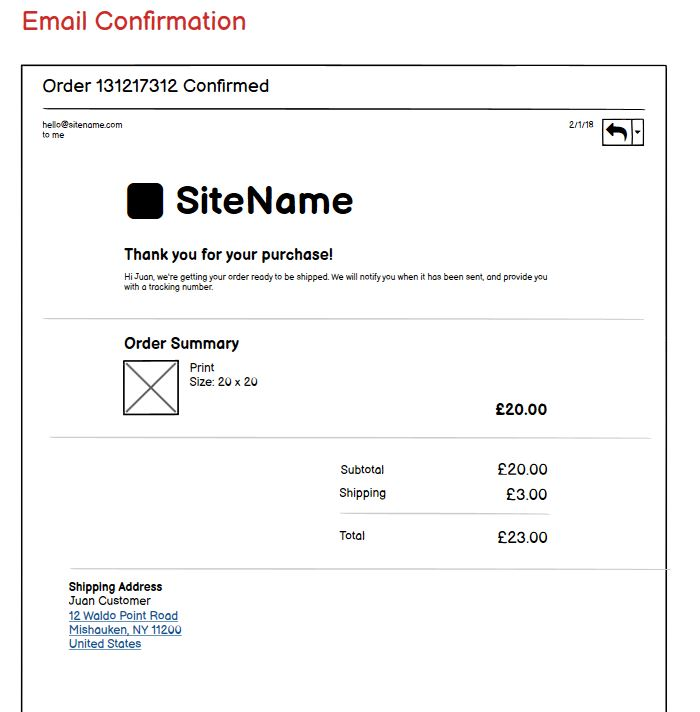
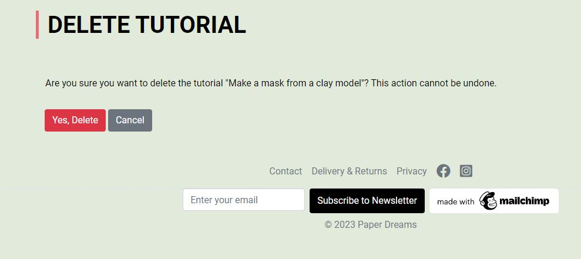
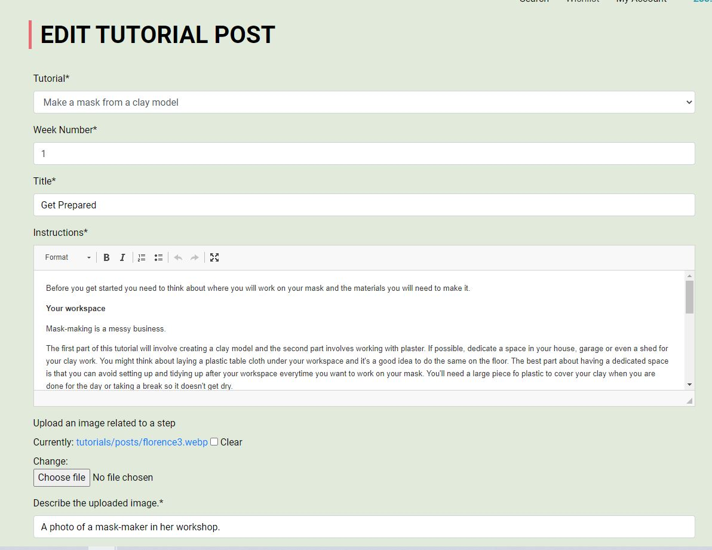

# Paper Dreams

This is a website for a fictional company called, "Paper Dreams," which has been developed as part of Code Institute Institute's Full Stack Developer Course (Portfolio Project 5). The artwork presented on the site is my own, with all rights reserved. The images are my own.

Paper Dreams is an ecommerce website for a paper-mache artist to sell a small collection of ever-changing masks, figurines and animal objects, paintings and prints and more. Customers can register with the site, which allows them to maintain an order history, a profile and a wishlist. Staff users can manage tutorials from the frontend and superusers have additional frontend access to Product Management. Both of these management functionalities are available via the navigation bar's "My Account" dropdown for the respective signed in users, but links are availble throughout the ecommerce sections of the site to manage these areas. Superusers also have a frontend link to the django admin panel in "My Account". You can  the live site [here.](https://paper-dreams-uk.herokuapp.com/)

## Table of Contents
---
- [Purpose and Goals](#purpose-and-goals)
    - [The audience](#the-audience)
    - [Broad User Goals](#broad-user-goals)
- [E-commerce Business Model](#e-commerce-business-model)
- [Marketing Goals](#marketing-goals)
- [Overall Goals](#overall-goals)
- [E-commerce Business Model](#e-commerce-business-model)
- [Marketing Strategy](#marketing-strategy)
    - [Marketing Goals](#marketing-goals)
- [SEO & Analytic](#seo--analytic)
- [Website Design](#website-design)
    - [The Strategy Plane](#the-strategy-plane)
        - [Emotional Factors](#emotional-factors)
        - [User Stories & Project Management](#user-stories--project-management)
        - [Agile Methodology](#agile-methodology)
    - [The Scope Plane](#the-scope-plane)
        - ["Must have" - Minimum Requirements](#must-have---minimum-requirements)
        - ["Should have" - Intended Requirements](#should-have---intended-requirements)
        - ["Could have" - Desired functionality that is not essential](#could-have---desired-functionality-that-is-not-essential)
        - [User Stories](#user-stories)
        - [Constraints](#contraints)
    - [The Structure Plane](#the-structure-plane)
    - [The Skeleton Plane](#the-skeleton-plane)
    - [The Surface Plane](#the-surface-plane)
        - [Branding](#branding)
        - [Fonts](#fonts)
        - [Colour Palette](#colour-palette)
        - [Accessibility](#accessibility)
- [Site Features](#site-features)

# Purpose and Goals
This purpose of this website is to allow the site owner to showcase and sell her artwork online. The artist would like to build a community of followers, which she aims to do by making free tutorials available online and creating a complimentary page on Facebook.

## The audience
Paper Dreams' audience matches the Etsy Community, whose audience is described as largely women between the ages of 18-35. Etsy estimates 86% of their buyers are female. Like Etsy, the site owner expects the audience to be young, female and interested in unique, original items with vibrant colour palettes. Etsy describes the buyer's behaviour and trends of which the following apply to Paper Dreams:

    - They want to support small businesses. They use the hashtag #StandWithSmall. The site could also make use of this hashtag. 
    - [Statusbrew](https://statusbrew.com/insights/small-business-hashtags/) lists some top trending small business hashtags. Top-Hashtags offers some useful ideas, moving away from the specific art scene to other interest areas of potential customers, such as #womanownedbusiness, #newbusiness, #supportsmallshops, #handcraftedgifts, #handmadecrafts, and #handcrafted"add item".

    - They want to make their homes more stylish with unique bright items.

    - The are interested in projects they can do from home. (Relates to tutorials/learn page)

    - The are looking for unique gifts for various occasions.

For the purpose of this marketing strategy, we want to think about our customer in narrow terms in order to be able to create useful keywords for the site and and overall marketing strategy.

- Age: My real life experience is that my papier mache work appeals to a type of personality more than an age group. I have sold my work to people young and old, whose enthusiam is driven by the same factors: to have something unique you can't find in a normal high street that brings a bit a sence of playfulness and joy to everyday life.
- Gender: mostly women. 
- Online hangouts: 
    - The younger generage is on Instagram, with middle-agers giving preference to Facebook. If I take this genuinely live, I will post to Instragram, which allows one to simultaneoulsy create posts on Facebook.
    - Likey to check accounts through the day, but most likely present in the evenings
- Interests: 
    - Social responsibility & Sustainability.
        Many of my projects are created with recycled materials, and this can be promoted. 
    - Enjoys browsing and shopping online
    - Listens to podcasts related to fashion, exercise, entrepreneurship, freelancing, cookery, health, lifestyle, goal-setting, mindfulness, and general well being
    - Reads blogs
    - Spending power
        - Likely to rent 
        - Decent income, but need to save and pay back loans
        - Likely to have a social life (no kids yet)
        - Up and coming in their careers, but will suffer if they become mothers.
    - Frustrations
        - Getting on the housing ladder
        - Progressing in career
        - Burnout at  work/instability in careers.
        - Lack of childcare options, if mothers

The artworks I produce allow the customer to have something unique and bespoke. While some of the items might be pricey, the are generally affordable and although the everyday person to have something truly unique, which is usually the preserver of rich people. 

As a note: the prices attached to some of the items are off the top of my head so to speak and while I do create things with moulds and it is possible to print many masks off the same plaster mould, in reality I wouldn't do more than 3-4 of the same mask, and most of the figures would be one-offs. I have created quantities for the sake of demonstrating the functionality.
        
## Overall Goals

Broad User Goals

- To find an browse available art.
- To buy something truly unique, which is likely to amount to a "guilty pleasure"
- To learn about the techniqes of mask-making and papier mache generally. Many tutorials fall just short of being helpful, and I would like to offer something that allows people a route to a new hobby.

Broad Site Owner Goals

- To have an online point of sale for the artwork.
- To be able to showcase her work online
- To build a community of people interested in papier mache, who will hopefully share Facebook posts as well as the website.

## E-commerce Business Model
The site owner sells to individuals, making her business a Business-to-Customer (B2C) model. The customer makes a single payment and there are no subscriptions or regular fees. The business sells directly to the customer, without the involvement of any outside parties.

Given the above, and the target audience, the website should
- Cater to individuals, and impulse buys by making purchases easy with a smooth, quick checkout process
- The site should build customer confidence:
	- The customer should get confirmation that all is well by receiving a confirmation page and email. 
	- Customers who log in should be able to see their order history
	- Customers should not be obliged to create a profile. Many customers don't want to save their details, and get annoyed when they need to do this as a requirement.
	- The customer should easily be able to find shipping and returns information. 
	- The customer should easily be able to find a privacy policy.
	- The customer should easily be able to find contact information, adding to the credibility and legitimacy of the website as a genuine business.
- Photos should be attractive - in practice I don't have access to my old professional photos and I've had to make do with what I could find. If I turn this into a genuine site post assessment, I will have professional photographs taken.
- While the artist won't initially have much to display, the site should allow for product filtering by category for the future.
- The site should have a search field so returning customers can find something they've seen before.
- The site should have a wishlist so customers can save items they are interested in and return to review them at a later time.
- The site owner wants the customer feel like they can get involved by trying a tutorial, or showing how they are displaying their artwork in their home.

## Marketing Strategy
The site owner is not interested in joining Etsy as she feels the platform is too crowded, and there is some suggestion it has declined. [TechPenny blames Etsy's algorithms](https://techpenny.com/typical-etsy-demographics-stats/) and the amount of time customers must spend on the platform only to get frustrated and leave after they don't find what they are looking form. By contrast, [Statista.com](https://www.statista.com/statistics/409375/etsy-active-buyers/) reported an 18% increase in sales. Reuter's reports Etsy has suffered related to [SVBs collapse with resulting delays processing sellers' payments](https://www.reuters.com/markets/etsy-other-e-commerce-companies-feel-squeeze-svb-collapse-2023-03-13/), with some sellers complaining Etsy lacked transparency. Notwithstanding these reports on the Etsy platform itself, there is a clear interest by consumers in handcrafted items created by small businesses. 

### Marketing Goals
The site owner will market through her Facebook Page, [Paper Dreams](https://www.facebook.com/profile.php?id=100091661127883). The idea is to build a community there by displaying work and providing free tutorials online and encourage site users to post their progress and results on the Facebook page. The artist is a local artist and sells at local markets where she can prominently display the site link. The intention would to get a domain name matching the name of the business so it is memorable.

The marketing goals are to:

- Showcase the artist's work on the website. The ecommerce site has the double function of being a portfolio for this artist to show off the bredth of her work. In future, more can be done, for example by expanding the about page, to give information about the inspiration behind her work. Also, the tutorials page gives great insight into her techniquess.
- Build brand awareness through an online presence. On a real site much effort would be put into the creation and use of a logo, but I didn't have resources for this mock-project. However, the colour scheme and the style of the site creates a memorable aesthetic.
- Generating leads. Emails can be collected through the MailChimp newsletter signup and via the contact form opt-in to the newsletter. 
- Engaging customers and followers. The tutorials page and the Facebook page gives people reasons to keep coming back o the site and engaging directly with the artist.
- Driving sales with email marketing. The eventual newsletter can be used to let people know where she will be exhibiting work. Future features could include a blog page for the purpose of such announcements and news.

### SEO & Analytic

1. Keyword Search

    - General for site
        - Short-tail: sustainable crafts, handmade  masks, handcrafted gifts, handmade gifts, unique interiors, unique decorations, affordable art
        - Long-tail: unique sustainable gifts, handmade by Surrey artist, fun decorations to brighten the home, gifts to lift your spirits, one-of-a-kind affordable artworks
    - Papier mache masks:
        - Short-tail keywords: papier mache masks, masks for sale, handcrafted masks, 
        - Long-tail keywords: handcrafted papier mache masks, unique papier mache masks, papier mache masks for Halloween
    - Papier mache figures and animals:
        - Short-tail keywords: whimsical art, quirky art, decorative animals, colorful art, 3d art, wacky figurines, unique sculptures
        - Long-tail keywords: handcrafted papier mache animals, handmade children's room decor, fun decorations for children's rooms, one-of-a-kind sculptures
    - Pen & ink prints:
        - Short-tail keywords: pen and ink prints, prints for sale
        - Long-tail keywords: black and white pen and ink prints, pen and ink abstract prints, pen and ink art prints, abstract art therapy
    - Paintings:
        - Short-tail keywords: paintings for sale, art paintings
        - Long-tail keywords: watercolour paintings for sale, abstract mixed media paintings for sale, modern art paintings
    - Tutorials:
        - Short-tails keywords: mask tutorial, papier mache tutorial
        - Long-tail keywords: how to make a bespoke mask, mould-making tips for mask-making, choosing the right paper for your papier mache project, inexpensive art projects to do at home, cheap things to do with kids, cool projects to make with paper and glue

2. On page optimization

    If this were a genuine business, it would make sense for the artist to use her name as the domain name and then change the site title to Paper Dreams by "Artist Name". Factors taken into account include relevant headings, meta tags, optimizing images for faster loading, making sure the site is mobile friendly. 

3. Off-page optimization

    If this  were a real site, the business should seek to engage with other artists and website owners by writing guest blogs, or by asking them to link to this site for its resources (the tutorials blog), events or by reviewing our site and art works. An obvious place to start would be papiermache.co.uk which is a platfrom for papier mache artists. By posting there regularly, you quickly become part of a community and if you post projects there, your project will be the first or one of the first visitors to the site will see. Many of these artists have their own websites and community connections and are generous with help and advice.
    
4. Technical optimization

    - Page loads fast, images are converted to webp
    - Mobile friendly
    - Easy to navigate

5. Content

    - Text is highly relevant to page purpose. No superflous text.
    - Non commercial content aims to retain visitors/create repeat visitors
    
6. Meta tags

    The various pages on this site leave little room for SEO keywords as there are few titles and subtitles, however there is ample opportunity in the product descriptions, which form the main content of the site. The tutorials also offer such a place.

    - Meta descriptions - I have put unique page descriptions on every content page: Homepage, Contact, Privacy, Delivery, Products and Tutorials. Google will not crawl through the pages that require user sign in. Pages restricted to signed in user's have helpful meta descriptions to say what the page is for. The meta tags needed to be placed in the extra_meta block as the presence of a tag in base.html would produces a duplication and error.

    - Meta keywords: I read [Google does not use the keywords meta tag in web ranking](https://developers.google.com/search/blog/2009/09/google-does-not-use-keywords-meta-tag) on "Google Search Central Blog" on  developers.google.com and have therefore not used them. I was surprised to see this information was already presented in 2009.

7. Evidence of being a trusted site

    The project includes a privacy policy to meet GDPR rules. There is also a contact page, and a delivery and returns policy This  helps customoer confidence, and improve SEO.

## Website Design
### The Strategy Plane
The goals of the site are similar to that of Etsy and NotOnTheHighStreet. This site aims to offer users unique items to bring a bit of joy into their lives.  The site owner does not wish to have a profile on these sites, because they wish to display works not for sale as well as to provide tutorials. While the site will be online, and can be thought of as having a global reach, the site owner is also very much involved in the community, and wishes to have an exclusive site.

#### Emotional Factors
It is the artist's hope that her artworks will help site visitors reimagine their surroundings. The site should be easy and intutive to navigate so as not to detract from the works themselves. An attractive website will add to the value of the work, as the same care taken to create the art should go into the presentation of it via the website. Even if the customer is not ready to buy, it is the hope of the site owner that the customer will like the experience of the site so much that they will return repeatedly to look and browse.  

As mentioned, the tutorials page is also meant to build community page and extends itself well to Facebook, where customers can share their own work, get support and also share posts to their friends and invite them to the page.

#### User Stories & Project Management
GitHub projects, milestones and issues were used to manage this story. The user stories were defined as issues with tick-box tasks and acceptance criteria. 

Looking back at the project, I realize I did not break them down enough into fine detail. For the sake of a project that one individual is doing on their own, it worked well. I liked having a piece of functionaly as a user story with multiple tasks written down with tick-boxes that I could leave open and tick off as I worked through. I can see how this might not be ideal working as part of a larger team. 

I should have created a separate level of developer stories. I did something like this for the project set-up, but didn't always carry it through the rest of the apps. As I was sitting with a spreadsheet of general requirments, both based on the project requirement's as well as a to do list. It didn't occur to me to include as user stories something like adding a "Page Not Found" or a Procfile as a specific "user" story.  I could have been much more granular with the user stories. As already mentioned, I think this is the result of working alone as opposed to with a team, among whom tasks are shared and a higher level of specifity is required for general management of a project.

#### Agile Methodology
The project was developed using Agile Methodology as presented in Code Institute modules. User stories and milestones were created on GitHub's project boards. Each user story was defined and given a status including "must have" (for minimum viable product), "should have" (functionality that would make the site work better but isn't absolutely necessary to launch the site) and "could have" (features that would be nice to include). Some of these items were transitioned to "won't have" as the time demands demanded prioritization of the must and should haves. 

GitHub's Milestones were initially used for the project iterations, but I found them awkward to set up and created a similar categories which I've called "steps" on the board. While we were encouraged to drag issues along a kanban board, I found it neater to organize my work on a .

The project board is at this [link](https://github.com/users/leah-jala/projects/8).

### The Scope Plane

Considering the goals above, the following requirements were identified.

#### "Must have" - Minimum Requirements
- A homepage which gives an overview of the purpose of the site, a clear call to action (shop button) and information about who is behind it.
- An intuitive navigation bar and a footer that leads customers to all the information they need to get in touch, review shipping and returns policies and browse products.
- A cleanly presented products page with an image, title and price for each item.
- A product detail page
- Customers should receive success/confirmation messages when adding products and throughout the checkout process.
- A checkout page that can be used without registration.
- A checkout page that can be used as a signed in user. 
- A checkout page that allows the customer to save their shipping details to their profile.
- A checkout process with Stripe that is safe for customers.
- After payment there should be success messages on screen.
- After payment, the customer should receive a confirmation email, including an order number and the products ordered. 
- A registered customer must be able to access their order history.
- A contact page that allows customer to submit questions via a form. 
- A tutorials page for the artist to be able to present tutorials as a blog, with images.

From the point of view of the site owner, it was important to me that customers can not buy products that aren't available in the database. I found this more important that having frontend Product and Tutorials Management access the admin interface can be controlled, WYSIWYG editors can be added to it, and it is easy to use. Having said that, the immediacy of edit and delete links through the site for signed in users have a clear benefit and should be there, but if I were forced to give priority for one over the other, the frontend management would come second. It avoids having to disappoint customers as well as eliminates the task of manually monitoring the databse.

#### "Should have" - Intended Requirements
- The ability to add items to a wish list. 
- It should be possible to search for products by item title.

#### "Could have" - Desired functionality that is not essential
- Site users should be able to comment on tutorials/blog entries and upload photos of their work. 
- Site users should be able to filter tutorials by title or theme (e.g. There might be more than one mask-making tutorial)
- An events page that allows the ower to use a form to enter information about upcoming events such as an exhibition or a course.

#### User Stories

Project Set Up
- As a developer, I need to create a django project, so that I can build the site apps.
- As a developer, I want to deploy my project early, so that I can avoid problems later in the project. (In practice I did this closer to the end of the project.)
- As a site owner, I need my customers to be able to sign in securely to the website so that they can make purchases or comment on blogs. (This was an example of a user story where I have grouped together tasks)

- As a developer, I need to create a project level template, to contain the common elements of the site.
- As a site owner, I want an attractive homepage so that my site users will explore the site.

Contact Page
- As a website visitor, I want to be able to fill out a form on the contact page to send a message to the website owner.
- As a website visitor, I want to be able to easily find the contact page so that I can get in touch with the website owner.
- As a website visitor, I would like a an email confirmation after I submit the contact form, so I can review the message I sent later.

Homepage
- As a developer, I need to set up a home app so I can build the index.html page.

Pages App
- As a site owner, I need to present policies on privacy and delivery to customers and information about the company, so customers know we are a legitimate company looking after their consumer rights.

Site wide
- As a site user I want to be able to search the website so I can find products I've looked at before.
- As a site owner, I want my customers to receive notifications to give them confirmation things are working.
- As a site user, I need a navbar to easily navigate the site and orient myself.
- As a site owner all the navbar links must work right so users can navigate my site.
- As a site user I want the site to have a footer so I know how to contact and stay in touch with the company.
- As a site owner I need to make sure my site can be found by search engines so I will have as much site traffic as possible.

Products
- As a site visitor, I want to search for products by keyword, so I can find items that match my interests quickly.
- As site user I want to be able to view the artwork by category so I can narrow down my selection
- As a site user, I need to be able to see a list of products so I can know the price and specific information such as size.
- As a site visitor, I want to view a list of products, so I can see the items available for purchase.

I should have included user stories here for Product Management.

Bag
- As a site user, I need to be able to add items I wish to purchase to a list, so I can see a summary of those items and the total cost.
- As a site user, I want to edit the shopping basket, so I can get the right quantity of each item.
- As a site user, I need to be able to add items I wish to purchase to a list, so I can see a summary of those items and the total cost.

Checkout
- As a site user, I want a simple checkout process so I can check out quickly and confidently.
- As a site user I want to be able to anonymously enter my payment information, so that I don't have to have a user account.
- As a site user, I want to receive an email confirmation/receipt, so that I have proof of purchase.
- As a site owner I need the the delivery charge to update automatically so "users are charged the correct amount".
- As a developer, I need to handle payments so our database is always up-to-date with payment confirmations.

Profiles
- As a site owner, I want users to be able to create a profile so they can view their order history and sign up for site information.
- As a site user, I want to be able to see my personal information, and review my orders, so I know what information the company holds.
- As a site user, I want to be be able to update my personal information so I my delivery and contact details are up to date.
- As a site user, I want to be able to go on my profile and see my order information.

Tutorials
- As a site user, I'd like a "how to section" of the website, so I can learn how to create my own artwork.
- As a superuser, I want a user friendly form to upload tutorials.
- As a Site owner I want to be about to edit my posts to make corrections, additions, etc.
- As a site owner, I want to be able to delete old posts when they are no longer needed.

Wishlist
- As a site user, I would like to be able to add and save items to a wishlist, so that I can can keep shopping and go back and review them later.
- As a site user I want to be able to remove an item from my wishlist when I am no longer interested.
- As a site user, I want to see if I have already added an item to my wishlist, so that I don't have to open the product detail page again.

### Contraints
The major constrainst is the timeline for completing the project.

### The Structure Plane
#### Planning
As this is an e-commerce site, the major objective is to sell artworks. The customer journey from the perspective of making a purchase is described below. The elements of the site related to tutorials have the objective of building advocacy for the company, enabling it to build a following and retain customer interest beyond the intitial point of sale.  

#### The Customer Journey

- **Discovery/Awareness:**  The customer is likely to hear about or find the website via word of mouth, search engines or social media. The site owner will not be buying advertising space.
    - User Action - asks a friend if they know any sites, uses keyword searches to find sites.
        - Emotion - initially curious. Happy.
        - Touch points - directly visit the site (word of mouth/recommendation), google result.
        - Consideration: Looks at multiple artworks before making a decision
    - User Action - Compares several sites
        - Touchpoints - homepage if given by friend, or directly landing on product page
- **Product detail page, or tutorials page** after Google search.
    - Emotions - If the site works as the user expects, they would be largely indifferent about the site itself, but if it requires too many clicks or if is hard to find what they are looking at they might get annoyed and leave the site.
    - Pain points:
        - Website is boring.
        - Website is difficult to navigate
        - Customer can be overwhelmed if there are too many clicks or steps to make it to purchase point.
        - Can't find an artwork they had already viewed.
        - Site loads slowly.
    - Solutions:
        - Navigation should be clear.
        - Photos and information on product page should be informative enough that the customer does not need to open every product detail page.
        - Product page should allow category filtering and a search field.
        - The inclusion of free information, like tutorials, and ways to get involved, for example exhibitions, should add interest and build a sense of community.
        - Create wishlist so user's can easily save items they are interested in to a list.
- **Selection and checkout**:
    - User actions: 
        - selects products, adds it to the bag, fills in form, enters card details, confirms payment.

    - Touch points:
        - **Products page**
        - **Products detail** page/Add to cart/bag
        - Go to secure checkout - brings you **shopping bag (summary) page**
        - Click secure checkout - brings to **checkout form**
        - **Log in** (if not already), or simply continute to payment field
        - Enter card detail into field - send to Stripe 
        - Adjust bag, or complete order
        - Get success message, with order summary or failure message
        - Get confirmation email.
    - Emotions: 
        - Happy if the process is fast, smooth and takes little time to complete.
        - Happy if the user doesn't not have to sign in, and receives plenty of confirmation along the way so they are confident the site works and will be secure.
        - Happy if they can call upon shipping details already entered in the past and purchase quicker. 
        - Angry if faced with a lot of error messages, forms that are unclear, a payment field that is not clear about what cards it accepts.
    - Pain points;
        - Form is so restrictive that it is hard to get through it without a lot of errors and repeated attempts to submit the form.
        - Checkout doesn't support all card types.
    - Solutions:
        - Clarify with symbols which cards are accepted.
- **Delivery**:
    - User Action: Customer receives item.
    - Pain Points: 
        - Item not delivered quickly.
        - Item damaged.
    - Solutions:
        - Sold out items never appear as available on the website.
        - Provide clear shipping and returns policies/information. 
        - Provide clear returns policy
        - Make footer sticky so returns and shipping policy always visiable.
        - Provide contact page to make it easy for customer to report problems.
- **Advocacy via Facebook page**: 
    - User Action
        - Leaves a great comment on facebook page.
        - Leaves a bad comment on facebook page if experience is bad.
        - Gives a poor review if customer service is poor following delivery problems, or unanswered questions. 
        - Recommends tutorials and exhibitions to friends interested in art. Links through to their own page
    - Touchpoints:
        - Contact page
        - Facebook page
    - Painpoints as mentioned above in user actions section.
    - Solutions:
        - Include shipping tracking field in custom model and trigger an email when product is marked as fulfilled.
        - Make it easy to share products
        - Post tutorials frequently, giving customers a reason to keep returning to the site for interesting activities and learning should create advocates for the website and company.

## The Skeleton Plane

### Wireframes
The homepage should look artsy and not like a commercial site. It should appeal to those looking for something unique and handmade. I have included some of my wireframes from the most important pages.

There is a benefit of the products pages being familiar/universal. I believe it gives confidence that owner has invested in professional web development, with the expected site security.

My profile

The checkout pages are very similar to what users would expect. I had hoped to make the checkout pages a bit more sophisticated but in practice didn't have time. 

Checkout email confirmation

Tutorials

Wishlist

#### Changes to wireframes
The wireframes were a useful guideline, however, I later decided to do different things with the Tutorials and Wishlist pages.  I didn't like the card format of the wishlist, but found rows were neater and easier to go through as a user. It was a minor change to the page layout. The tutorials app represents a bigger change as I decided that I didn't want to present them in a blog format. I wanted to keep the posts together with the tutorial overview, which I thought was much better UX. Now users can scroll through a list of avaiable tutorials, but when they click on one, they will always have everything they need together in one view with the possibility to click on links to the different posts/steps in the tutorial.

### The Surface Plane

#### Branding
The branding on this mock site is acheived mainly through a colour palette. I did not have resources to create a professional logo. This would obviously be important and then used on email headers, throughout the site and on facebook pages and another other communication off the website.
#### Fonts
As many of the items on the site are fun and aim to add a bit of spice and fun into people's environment, the site user wanted a font that reflected this. The site name/logo will uses Henny Penny, 

#### Colour Palette
I took some inspiration from the 2016 and 2017 [W3 Schools color palettes](https://www.w3schools.com/colors/colors_palettes.asp), however in the end choose my own combination of colors. 
- Fonts/Text - black
- Header highlights/Button hover: #dc3545
- Background: #e2ebdb

I wanted colors that were unique and artsy, but not a distraction to the artwork itself. The small highlights to the page add a bit of interest without being overwhelming or distracting. 

#### Accessibility
Effort has been taking to create a site with color contrast, semantic html for compatibility with assistive technologys and the ability to logically tab through a site, the use of aria-lables and image alts.

## Site Features

### Navbar
- The navbar contains the website name, and links to all pages on the site, apart from those related to the checkout once you only see once completing a transaction.
- The navbar is "sticky" so users can always see their wishlist and shopping bag status. 
- Website name is a link that brings users back to the homepage.
- Nav bar collapses on small screens.
- Home: returns users to the homepage
- About: brings users to a page about the company.
- Contact: brings user's to a contact form.
- Tutorials: Takes users to a list of available tutorials. There is at present only one.
- Shop: A dropdown menu allowing users to go to a page with all artwork, or to go to one of the categories.
- Search: This allows customers to search products. As this is an art website and will never have 100s of artworks for sale, it is not as vital as it would be for a larger store in the sense that the field should be ever present. I have offered the functionality as an icon and popup form. 
- Wishlist for signed in users. 
    - If nothing is on the wishlist the heart is an outline
    - If a product is on the wishlist, the heart displays read
- Wishlist icon does not display for user's who are not signed in
-Sign in/Register - This displays in the navbar for unauthenticated users. The dropdown options are to Register or login
- My Account- if the user is logged in and not a superuser of staff member, they will see
    - My Profile
    - Logout
    if the authenticated user is a staff member, they will additioanlly see
    - Tutorials Management
    if the authenticated user is a superuser, they will additionally see
    - Admin: link to admin panel
    - Product Management

### Footer
- Link to contact page, that allows the user to submit a form and signup for the newsletter.
- Link to delivery and returns page
- Link to privacy policy page
- Social media links
- Mail Chimp sign up form - This took quite a lot of effort to convert into the horizontal shape it is in now. I could not find a ready made option on Mail Chimp to do this.

### Homepage

As this is intended as an artist's page, I wanted something  "artsy", mainly meaning I didn't want it to look like every other commercial site out there with a large hero and a shop button. I wanted people to spend time looking at the images and hovering over them. I wanted the introduction to this site to evoke, "wow, that's different". I looked at a lot of websites and they just all seemed the same. I saw sign at a high street estate agents making use of hexagons that really caught my eye, and decided to see if I could just something with this. 

The user is able to hover over the photos which reveal a category they can click on including all the product categories and the tututorials page. 

### About Page
This is a brief description of the company and artist, and could be developed further in the future. 

### Tutorials 
- Tutorials List: When you click on tutorials you get a list of all tutorials available. At present there is only one.  This gives a brief overview of the time and skill level needed and a brief summary of the tutorial.
-  When the user clicks "view" from the tutorials page, they are brought to the detail page. It defaults to the first tutorial available, but each tutorial available in the series appears as a link at the bottom of the summary. The active step in the tutorial is highlighted green. This will allow a new user to see the tutorial from it's starting point, whereas return users can quickly go back to where they left off, but also quickly look back at any instructions as needed.

### Tutorials Management
There are front-end pages a staff user can use to manage their tutorials. The idea being that different people might be invited to contribute to the site, without needing full access to the site. A signed in user can see the following:
    - Instructions and a button to add an entirely new tutorial called, "Add a new tutorial"
    - A box with any existing tutorials, with the same appearance as on the tutorials  page, giving familiarity.  There are view, edit and delete buttons for the the overall tutorial, set to the top. Then, clearly beneath, there are edit and delete buttons for the individual posts. 
    
    - If someone clicks delete, they are brought to a confirmation screen asking if they really meant to delete and that the action can't be undone.
    
    - If the user chooses to edit their work, they are brought to a user friendly screen with formatting tools and an image upload. 
    
    - The add/edit tutorial and add tutorial posts pages look and function the same. 
    - The staff user is also provided a button from the main tutorials page (as would be navigated to by any user) so that if they see something that needs a correction, they can easily get to the Manage Tutorials page without have to use the My Account dropdown. 

The tutorials TutorialPost model makes use of django's 'ResizedImageField". With this, I was able to create parameters for the photo uploads, sizing the pixel size (400), the quality (75%, reducing file size), the directory, the image format (webp) and whether or not the image is a required field. I discovered this late in the project, otherwise I would have used it on the equivalent products model.

### Shop, including wishlist
The shop is based on what most every e-commerce site looks like, including Boutique Ado on which this is based. This was chosen as I believe it is what people expect to see and be familiar with. I think it is with reason that every major site uses this model of presentation. 

#### Quantity Feature 

To distinguish this project from Boutique Ado, I have added a quantity to the model, and I have also added a wishlist feature, which is a separate app in the project. 

Product page features

- The products are organized as series of cards that dyanmically stack for smaller screens.
- Key informmation is available, allow customers to see an impage, the price, and the category, with the options to click on a category or to add the item to their wish list. 
- The buttoms above the cards confirm what category the user is viewing, allowing them to also go to another category.
- There is a sorting feature which allows the customer to sort by price category and name. 

Product detail page features.
    - A customer can not add more to their basket than is available in the database. 
    - On the product detail page, the customer can see how many products are available in the shop and in parentheses, they can see how many are in their bag.

- Only after their purchase will the new calculation of store quantity be shown. 

    - In the example, the user has added one cobra. When they go back to the cobra, they will not be able to add more than 2.
    - users need to be signed in to use the wishlist. Users who are not signed or not registered are provided a link to do so, so that they can use the wishlist. 
    
    

### Wishlist App
- When the user is signed in the wishlist icon appears in the navbar

- When an item is on the wishlist, the heart is filled in red as shown.
- When there are no items on the wishlist, it appears as an outline.
- The same is true on the products and products detail pages. 

- The user receives a success message after adding an item to the wishlist

- The user is then able to click on the wishlist from the products and products detail page, or by clicking the icon on the navbar. Once clicked, the wishlist page opens.

- On this page the user and click the view page where they can see the detail and add it to their bag, or they can remove the item. 
- Once the item is removed, that item will return to the state of having a heart outline.
    - If there are still items on the wishlist, the navbar icon stays lit
    - If the wishlist is emptied, the navbar returns to an outline. 
- If I user buys an item on their wishlist, that item is removed from the wishlist. This is coded into the checkout view. 
- If a user tries to add a product that is on the wishlist, they receive an message that the item is already in their bag, and it is not added to the wishlist. The intention is to help users if they didn't realization they had previously added it to the basket, when they had meant to put it on their wishlist. They are instructed to remove it from the bag and then add it to the wishlist.
- If an user adds an item to the wishlist, then decides to put the item in their shopping bag, the heart stays lit. I felt it would take away from the fun of the purchase to see the heart empty after adding the artwork to the bag. 

### Products Management
- Products can be managed by the superuser from the frontend. 
- A link is made available for superusers in the navbar under My Account. You can see all the options for superusers below as well and the contact form. 

Note: Superusers get links to the admin panel, tutorials management, products management, in additional to what a normal user sees. Staff users can not see the products management nor the admin panel.

- The contact form allows users to see genuine information about the location of the seller and will hopefully server to add confidence. I personally do not like to only have a contact form with no real details, but I also like to be able to use a form as a first preference over an email address so I have more confidence my message will be received. 

### Search Utility
There is a search field in the navbar. This has already been described above in the navbar section. I felt that the shop would never be so large as to need a constantly present form field, but that it had a purpose on the site. The form field on large screens, in my opinion, took away from the character of the site, so it appears as a clickable icon on all screens. 

### My Profile
The profile section allows signed in users to see their default delivery and order history. I will not go into great detail about it as it is modeled after Boutique Ado, which is well known to the assessors. The page has been built dynamically with Bootstrap rather than using tables. 

### Shopping Bag & Checkout
These sections are modeled after Boutique Ado and therefore I will not detail it. It is fully functional. Clicking on the shopping icond on the shopping icon brings you to the bag page where item quantities can be adjusted. The added feature of product availability is on this page. 

- Secure checkout
    - This page can be assessed from the toast/message or from the bag page. 

- Missing fields, such as name, or address fields, are handled by the form.

- The customer then receives a confirmation.

- The confirmation page then becomes available as an order history page on the customer's profile page. When an order link is clicked they get a message to let them know they are looking at a past order.

- The customer similarly receives a confirmation email.

Webhook handler

- The transaction is also managed at the backend by a webhook handler. The handle_payment_intent_succeeded() method is responsible for processing a payment that has been successfully processed by Stripe. The method retrieves information related to the payment intent, such as the payment ID, the bag, and whether or not the customer wants to save their information. It then creates an order and associated order line items in the database based on the bag information. The method also updates the user's profile information if the save_info field is set to True. If the order already exists in the database, the method sends a confirmation email to the customer and returns a success message. Otherwise, it creates a new order and sends a confirmation email to the customer. The two files, webhooks.py and webhook_handler.py are taken directly from Boutique Ado. 

Below is confirmation that the webhook handler is working successfully.

### MailChimp Newsletter

A MailChimp form has been included on the footer so users can quickly join the mailing list for the store newsletter. The user is asked to verify their email by mailchimp once added. 

### Delivery and Returns
Delivery and returns information is available in the footer and spells out
how items will be delivered to the customer and under what circumstances returns are accepted. 

### Privacy
The privacy policy has been generated with the policy generator in the credits. It provides an account of GDPR adherence. In a real project, the company would of course need to have genuine policies in place, and appointed individual and be able to demonstrate adherence through regular practice.

### Facebook Page
This has been mentioned above in the marketing plan. This is an image of the page in case it is deleted by Facebook. This page repeats images from the site and it the post visible, it promotes the site's tutorials. The idea is to build community through the tutorials and drive people to the site this way.

The page is promoted in the tutorials text, the footer and on the contact page.

## Criterion for custom models

### At least three original custom models

Tutorials App

1. TutorialCategory: a model to enable adding tutorial categories in the admin panel. It contains a name and a friendly name.
2. Tutorial: a model to create tutorial content. It contains the instructor's user ID, title, category, difficulty level, duration, summary, equipment list, image, image alternative text, and created date.
3. TutorialPost: a model to create tutorial posts associated with a tutorial. It contains the tutorial ID, instructor's user ID, week number, title, instructions, image, image alternative text, and posted date.

Wishlist App

4. Wishlist: This script defines a Wishlist model that allows customers to store their favorite artworks. The model contains a OneToOneField to the User model, which links the wishlist to the user who created it. The ManyToManyField links the Product model to the wishlist, allowing a user to add multiple products to their wishlist. This information is accessible via the admin panel, and I expect it would provide interesting insight regarding preferences.

Contact App

5. ContactForm: This model  stores information from a contact form submitted by a user. The model contains fields for the user's first name, last name, email, subject, message, whether or not they want to subscribe to a newsletter, and the date the form was submitted. This information is available in the django admin panel.

## All database models, summarized

I struggled to create a LucidChart then lost the work. I summarizing how the models are connected below.

Checkout App:

a. Order Model
- Primary Key: order_number
- ForeignKey: user_profile (one-to-many relationship with UserProfile)
- ForeignKey: country (one-to-many relationship with django_countries.Country)
b. OrderLineItem Model
- Primary Key: (order, product) (composite key)
- ForeignKey: order (one-to-many relationship with Order)
- ForeignKey: product (one-to-many relationship with Product)

Contact App:
a. ContactForm Model
- Primary Key: id (automatically created by Django)

Products App:
a. Category Model
- Primary Key: id (automatically created by Django)

The Category model in the products app represents product categories in the store. Each category has a name and a friendly name.

b. Product Model
- Primary Key: id (automatically created by Django)
- ForeignKey: category (one-to-many relationship with Category)

Profiles App:
a. UserProfile Model
- Primary Key: user (one-to-one relationship with User)
- ForeignKey: default_country (one-to-many relationship with django_countries.Country)

Tutorials App:
a. TutorialCategory Model
- Primary Key: id (automatically created by Django)
b. Tutorial Model
- Primary Key: id (automatically created by Django)
- ForeignKey: instructor (one-to-many relationship with User)
- ForeignKey: category (one-to-many relationship with TutorialCategory)
c. TutorialPost Model
- Primary Key: id (automatically created by Django)
- ForeignKey: tutorial (one-to-many relationship with Tutorial)
- ForeignKey: instructor (one-to-many relationship with User)

Wishlist App:
a. Wishlist Model
- Primary Key: user (one-to-one relationship with User)
- ManyToManyField: products (many-to-many relationship with Product)

## Future features
- I would add icons above the Stripe field for the major credit cards accepted for additional confirmation to the customer.
- Once an item is sold out, I would like it to be automatically taken off the products list and moved to a gallery page where customers can view past works, with search and sorting, in addition to anything current I want to show (like commissioned items that will not be sold). Like this, I would have a portfolio page. I would also like customers to be able to click through, comment and also add pictures of their artwork as they are displaying it in their homes. Also, I would like them to have a link to click to enquire about have a previously sold item made. There is a limit to how fast an artist can create work, so the gallery would show a greater body of work and what is possible if the customer is willing to wait.
- Search field should be altered for fuzzy logic.
- Checkout page: If a form is filled in when the user sees the link it should keep the information through the login. I have moved the links higher up the form to avoid a situation where a person only sees the link after filling in their information. 
- If there were a lot more products in the store, it would make sense to add more categories for the sort by field, for example people interested in buy an artwork might like to look for specific colors. 
- It would be good to add sharing functionality to the products and product details pages, so if someone sees a product they think a friend might like, they can immediate share it.
- I would like a feature to allow someone to add a product from the products page, without having to click through the detail page. Someone might consider an item and return to later in the same or another session and not need to see the detail page.
- I would like to be able to allow customers to sort by "New" or "Recently added" in the sort filter field.
- I realized late that the email is not editable on the profiles page, and would like to correct this, but with some authentication process.
- It would be good to include customer reviews on the detail page, as there is space for that, and then to have a link on the products page to show a review is available. 
- In the checkout, it would be better if the countries field was set to the UK (home country) by default.
- Use django ResizedImageField throughout the project and explore other image management tools.

## Installed packages
This project was built with Python3 and Django 3.2. The following packages were installed.
Use pip install + app name, then add to settings. 

- [boto3](https://django-storages.readthedocs.io/en/latest/backends/amazon-S3.html) - Supports Amazon web services
- [ckeditor](https://django-ckeditor.readthedocs.io/en/latest/) - Provides richtext fields, WYSIWYG editing and image management. 
- [django3.2](https://docs.djangoproject.com/en/dev/releases/3.2/) - a LTS version of django offering stability and security.
- [django-allauth](https://django-allauth.readthedocs.io/en/latest/installation.html) - Handles authentication and site registration
- [Django countries](https://pypi.org/project/django-countries/) for countries dropdown list in checkout form
- [Django Crisy Forms](https://django-crispy-forms.readthedocs.io/en/latest/) for rendering and styling of forms
- gunicorn - A Python WSGI HTTP server that allows you to run Django applications.
-[Pillow](https://pypi.org/project/Pillow/) - A python library for working with digital images
- oauthlib (Allauth)- A Python library that provides a set of OAuth and OAuth2 client and server tools.
- [Stripe](https://docs.dj-stripe.dev/en/master/) - Python library to create an interface with the Stripe payment platform.

### Other Technologies and resources

Languages
- HTML
- CSS
- Javascript & Jquery
- Python (with Django Framework)

Libraries & Programmes
- [SQLLite](https://www.sqlite.org/index.html) the local development database
- [Django web framework](https://www.djangoproject.com/), to build the site
- [Stripe](https://stripe.com/ie) for handling payments (test onlyh)
- [Bootstrap v4.6.2](https://getbootstrap.com) for responsive page design
- [jQuery](https://jquery.com/)
- [Chrome Dev Tools](https://developer.chrome.com/docs/devtools/)
- [Mailchimp](https://mailchimp.com/) for the newsletter sign up form in the site footer
- [Facebook](https://www.facebook.com/) to create the Facebook business page
- [Am I Responsive](http://ami.responsivedesign.is/#) to generate the mockup image showing the project on different devices
- [XML-Sitemaps.com](https://www.xml-sitemaps.com/) to generate the sitemap
- [Privacy Policy Generator](https://www.privacypolicygenerator.info/)

Fonts and Icons
- [Google Fonts](https://fonts.google.com/)
- [Font Pairing, by Our Own Thing](http://www.ourownthing.co.uk/fontpairing/)
- Favicon.io
- Font Awesome

Planning and resources
- [Markdown Cheat Sheet](https://www.markdownguide.org/cheat-sheet/)
- Lucid Charts (lost work)
- [Balsamiq](https://balsamiq.com/) to design the wireframes

Images
- Cloud convert

Version Control and editor
- Git for version control, using the [Gitpod](https://www.gitpod.io/) terminal to commit to Git and push to GitHub, and facilitated by the Code Institute Full Template
- [GitHub](https://github.com/) to store the project code
    - including GitHub's project and milestone features for agile planning
- GitPod editor

Deployment resources
- [Heroku](https://www.heroku.com/) to deploy the website
- [Elephant SQL](https://www.elephantsql.com/) PostGres database for deployed site
- [AWS](https://aws.amazon.com/) to host media and static files.

SEO/Site maps
- [Online sitemap generator](https://www.xml-sitemaps.com/)
- [Wordtracker](https://www.wordtracker.com/) - USER FREE TRIAL!
- [https://search.google.com/search-console/about](Register sitemap)

Language Validators and format helpers
- [W3C HTML validator](https://validator.w3.org/) to validate the HTML code
- [W3C CSS Validator](https://jigsaw.w3.org/css-validator/) to validate the CSS code
- [JSHint](https://jshint.com/) to check the quality of and check for errors in the JavaScript code
- [Code Institute Python Linter](https://pep8ci.herokuapp.com/) checker to validate the Python code
- [autopep8](https://pypi.org/project/autopep8/), A tool that automatically formats Python code to conform to the PEP 8 style guide

## Testing

## Develoment, Version Control & Deployment
- A repository was created using Code Institute's template, which sets up the environment for git version control.
- Files were added to the staging area with git . 
- This project uses Django 3.2, installed with pip3 install Django==3.2. This is a long-term support (LTS) version.
- The project was create in Django with start  
- Files were committed with git -m "commit message"
- Libraries and frameworks were installed with pip3 install
    - Installed packages were saved to requirements with pip3 freeze > requirements.text
    - Committed changes were saved with pip3 install.

## Forking the repository
- Login to GitHub
- Go to this repository
- Locate and click the fork button
- Create and env.py file, and install the requirements: pip install -r requirements.txt, then use the following command, pip install -r requirements.txt
    - create and add an env.py file to .gitignore for secret keys.
    - add *.squlite3 to the env.py file, as this is not automatically included.
- create a superuser  with "python3 manage.py create superuser"
- Add new apps with django manage.py startapp appname, remember to add this to installed apps in settings.
- Migrate models with "python3 manage.py makemigrations" and "python3 manage.py migrate"
- run the server, "python3 manage.py runserver" to check settings. 

## Cloning the repository
- Login to GitHub
- Go to this repository
- Click the green code button and in the clone section copy the link
- Go to your dev environment and create or change the directory to the location you want to add the cloned directory.
- On the command line type "git clone" and the copied url from the above step.
- Follow the steps above to create an env and gitignore file

## The settings.py
To help understand the settings file, in the initial set up of this project, the following actions were

- Settings in this project have been edited during project set up to include allauth 0.41.1        
    Authentication backends were added:
    - 'django.contrib.auth.backends.ModelBackend',
    - 'allauth.account.auth_backends.AuthenticationBackend',
    Allauth apps to installed apps
    - 'django.contrib.sites',
    - 'allauth',
    - 'allauth.account',
    - 'allauth.account',
    Authentication backends
    - SITE_ID = 1
- Allauth urls
    - path('accounts/', include('allauth.urls')),
    - from django.urls import path, include
- Login with superuser details
    - update domain name
    - change the display name
- Temporarily set up email to log to the console in settings
    - EMAIL_BACKEND = 'django.core.mail.backends.console.EmailBackend'
    - DEFAULT_FROM_EMAIL = 'yoursitename@example.com'
- Add account information
    - ACCOUNT_AUTHENTICATION_METHOD = 'username_email'
    - ACCOUNT_EMAIL_REQUIRED = True
    - ACCOUNT_EMAIL_VERIFICATION = 'mandatory'
    - ACCOUNT_SIGNUP_EMAIL_ENTER_TWICE = True
    - ACCOUNT_USERNAME_MIN_LENGTH = 4
    - LOGIN_URL = '/accounts/login/'
    - LOGIN_REDIRECT_URL = '/'
- Go to accounts log in "/accounts/login/" and use the form and confirm the email manaully in the admin panel.
- freeze requirements
- setup templates directory for allauth templates
    - mkdir templates
    - mkdir templates/allauth
- If using GitPod, access the templates like ths: 
    -  enter pip show django-allauth, to get the location of the files, for me this was "/workspace/.pip-modules/lib/python3.8/site-packages"
    - copy the files to the directory: based on teh above I needed to run "cp -r /home/gitpod/.pyenv/versions/3.8.11/lib/python3.8/site-packages/allauth/templates/* ./templates/allauth/"

- Setting were also edited to include the storages, Crispy forms templates, Stripe payments, add custom apps, the djrichtextfield, Stripe and they were also changed to allow the project to run in the development environment after deployment.
        if 'DATABASE_URL' in os.environ:
            DATABASES = {
                'default': dj_database_url.parse(os.environ.get('DATABASE_URL'))
            }
        else:
            DATABASES = {
                'default': {
                    'ENGINE': 'django.db.backends.sqlite3',
                    'NAME': os.path.join(BASE_DIR, 'db.sqlite3'),
                }
            }

## To deploy

- Set up your database. This project uses ElephantSQL (elephantsql.com). You need to create an account, give it a name, select a plan (this project uses the TinyTurtle free plan), select a region, review and create an instance. Then copy the database url.
- Set up Heroku. Create an account, if you don't have one. Give the app a name, choose a region and click the create app button. Then go to settings in this new app, open the config vars and add the database url you copied from the previous step.
- connect the database to your local development web server
    On the command line
    -  pip3 install dj_database_url==0.5.0 psycopg2
    -  pip freeze > requirements.txt
    At the top of settings
        -  import os
        -  import dj_database_url
    In the databases section settings, comment out the original settings and add your own database url:

         # DATABASES = {
         #     'default': {
         #         'ENGINE': 'django.db.backends.sqlite3',
         #         'NAME': os.path.join(BASE_DIR, 'db.sqlite3'),
         #     }
         # }
                    
        DATABASES = {
            'default': dj_database_url.parse('your-database-url-here')
        }
        !!!!!!!!!!!!!
        DON'T PUSH THIS INFORMATION YET.
        !!!!!!!!!!!!!

        Confirm your database is connected:
        -  python3 manage.py showmigrations
        Migrate your database models
        -  python3 manage.py migrate
        If you are using fixtures (this project doesn't), load categories first then your products
        -  python3 manage.py loaddata categories
        -   python3 manage.py loaddata products
        Create a new superuser for the new database
        -  python3 manage.py createsuperuser
        Delete your database variable and uncomment the above code again to connect to your sqlite3 database.
- Go back to elephantsql, navigate to BROWSER, click the table queries button and select auth_user and click execute. You should be able to see your superuse which also confirms tables have been set up. 
- Set up environment variable for database
    - install gunicorn, pip3 install gunicorn, which acts as the webserver
        - add the following to settings

    if 'DATABASE_URL' in os.environ:
        DATABASES = {
            'default': dj_database_url.parse(os.environ.get('DATABASE_URL'))
        }
    else:
        DATABASES = {
            'default': {
                'ENGINE': 'django.db.backends.sqlite3',
                'NAME': os.path.join(BASE_DIR, 'db.sqlite3'),
            }
        }
    - Create a procfile - this tells heroku to create a web dyno to run gunicorn
        - web: gunicorn paperdreams.wsgi:application
    - Disable Collectstatic. You can do this directly in heroku settings or on the command line with "heroku config: set DISABLE_COLLECTSTATIC=1 -- app "your app"
    - Add Heroku as an ALLOWED_HOST in settings, add local host as the 2nd argument so gitpod/your dev environment  will still work. 

        ALLOWED_HOSTS = ['paper-dreams-uk.herokuapp.com', 'localhost']

- Add, commit and push changes with "git push heroku main". You can also set connect heroku to your github repository from ther heroku website, which in my opinion is simpler. 

Create an account to host your static files. This project uses AWS s3 (aws.amazon.com)
- Create an AWS account, follow the instructions. This is a free usage limit, so a credit card is required.
- Sign in
Create a bucket
- Search for s3 in the search bar.
- Create a new "Bucket"
- Click on the ACLs enbled option
- Click on Bucket owner preferred
- Select your closest region.
- Uncheck block all public acccess
- Create bucket
Go to properties
- Turn on static website hosting
- Use the default values in the index and error document sections fo the form.
On permissions tab
- Paste in Cors configuration. 
[
  {
      "AllowedHeaders": [
          "Authorization"
      ],
      "AllowedMethods": [
          "GET"
      ],
      "AllowedOrigins": [
          "*"
      ],
      "ExposeHeaders": []
  }
]
Open up "Go to Bucket policy tab" in a new browser tab so you can easily go back and fetch the Amazon Resource Name (ARN)
- Create a security policy with the policy generator - S3 Bucket policy. This sets up access for Heroku.
    - Select "allow" next to Effect. 
    - enter an "*" in principle field
    - the action is "GetObject"
    - pasted in your ARN
    - click through and add the statement
    - generate the policy
    - copy this policy into the bucket policy editor, add "/*" to the end of the resource key
    - save 
- Go to ACL (access control list) tab, and set the public access to "everyone"

- Create a user for access in IAM - Identity and Access Management
    - Create Group
        - Create a new group called "manage-yourappname"
    - Create Access Policy
        - Go to policies and create policy. 
        - Go to JSON tab and import managed policy - search for s3 and import the s3 full access policy
        - Get the bucket ARN from the bucket policy editor, then go back and pasted it in the resource line of the code. It's a list. Add the ARN.  eg 
            "Resource": [
                "arn:aws:s3:::thedetailsfromyourarn",
                "arn:aws:s3:::thedetailsfromyourarn/*",
            ]
        - Review the policy and give it a name and description
        - Create a policy
        - Attach the policy to your newly created group. To attach the policy, on the sidebar clickUser Groups.Select your group, go to thepermissionstab, open theAdd permissionsdropdown, and clickAttachpolicies.Select the policy and clickAdd permissionsat the bottom.
    - Assign the user to the group
        - Go to users page and add a user.
        - Give the user programmatic access
        - Download the user's access key and secret key. You can only download this once. 

-  Configure django

    Install boto3 and django-storages on the command line and freeze requirements

    In settings, add this under MEDIA_ROOT, and add AWS access and secret keys to your Heroku app's config vars. Also include the USE_AWS set to True. You can now remove the DISABLE_COLLECTSTATIC config var.

    Create a custom_storages.py file. (see file in repo).

    Tell browser it's ok to cache media files (AWS_S3_OBJECT_PARAMETERS below).

    The final result in settings is below.

    if 'USE_AWS' in os.environ:
        # Cache control
        AWS_S3_OBJECT_PARAMETERS = {
            'Expires': 'Thu, 31 Dec 2099 20:00:00 GMT',
            'CacheControl': 'max-age=94608000',
            }

            # Bucket Config
            AWS_STORAGE_BUCKET_NAME = 'paper-dreams-uk'
            AWS_S3_REGION_NAME = 'eu-west-2'
            AWS_ACCESS_KEY_ID = os.environ.get('AWS_ACCESS_KEY_ID')
            AWS_SECRET_ACCESS_KEY = os.environ.get('AWS_SECRET_ACCESS_KEY')
            AWS_S3_CUSTOM_DOMAIN = f'{AWS_STORAGE_BUCKET_NAME}.s3.amazonaws.com'

            # Static and media files
            STATICFILES_STORAGE = 'custom_storages.StaticStorage'
            STATICFILES_LOCATION = 'static'
            DEFAULT_FILE_STORAGE = 'custom_storages.MediaStorage'
            MEDIAFILES_LOCATION = 'media'

            # Override static and media URLs in production
            STATIC_URL = f'https://{AWS_S3_CUSTOM_DOMAIN}/{STATICFILES_LOCATION}/'
            MEDIA_URL = f'https://{AWS_S3_CUSTOM_DOMAIN}/{MEDIAFILES_LOCATION}/

Add, commit and push the changes. 

Go back to AWS S3 and create a media folder. Use the upload button and add your media files. Click next then manage public permissions give public read access then click upload.

Go to django admin, got to email addressses and confirm the superuser email address. 

Log into Stripe if you are using it and added the public and secret keys to your Heroku app's config vars. Make sure to add a new webhook endpoint in Stripe for your Heroku app url. Add the url with "/checkout/wh" and select receive all events and add the new endpoint. Reveal the webhook sign in secret and add this to the Heroku config vars, then test the webhook. 

## Credits

### Special thanks
Daisy McGirr, my mentor, has been a brilliant source of advice and support. I watched a few of her videos for insight on how to use the djrichtext field and create a model that sets parameters for images. 
 - [Django Recipe Sharing Tutorial - videos 7-10](https://www.youtube.com/@IonaFrisbee)

### Boutique Ado walkthrough
- The products, bag and checkout apps are based on the Code Institute Boutique Ado walkthrough.

### General resources
- [MDN Web docs](https://developer.mozilla.org/en-US/docs/Web/CSS/background-image) for help with background images, and their positioning.
- Django documentation

### Resources consulted to create the hexagon shapes
- [CSS Tricks](https://css-tricks.com/hexagons-and-beyond-flexible-responsive-grid-patterns-sans-media-queries/) 
- [Temani Afif's Codepen](https://codepen.io/t_afif/pen/zYoZBOy) of a responsive hexagon grid
- [kizu's public fiddles](http://jsfiddle.net/kizu/bhGn4/), found via StackOverflow.
- [Darsain's Codpen](https://codepen.io/darsain/pen/DQKWqM) 

### Media queries to handle hover properties
- [Dealing with hover on mobile, Kevin Powell, Youtube](https://www.google.com/search?q=hover+effect+on+phone&oq=hover+effect+on+phone&aqs=chrome..69i57j0i22i30l2j0i390i650l5.7290j0j7&sourceid=chrome&ie=UTF-8#kpvalbx=_v3cfZODdPISZhbIPwaaSiAg_35)

### Scroll to top button on products page
- [The Joomla Forum, How to scroll to the top smoothly, contributiion by "LikeStuff"](https://forum.joomla.org/viewtopic.php?f=706&t=971785)
- [Create Scroll Back to Top Button using jQuery and CSS](https://www.codexworld.com/back-to-top-button-using-jquery-css/#:~:text=Use%20the%20jQuery%20click%20event,to%20the%20top%20using%20jQuery.)

### Wishlist
- [Stackoverflow](https://stackoverflow.com/questions/73947103/django-add-to-wishlist?rq=1) - using the "get_or_create"

### Returning user back to the page they came from
- [How to redirect to a previous page in django](https://copyprogramming.com/howto/how-to-redirect-to-previous-page-in-django)

### Shopping bag
- [Shopping bag Bootstrap/Html](https://mdbootstrap.com/docs/standard/extended/shopping-carts/) adapted from MDB

## Toasts
- [Bootstrap Toasts](https://getbootstrap.com/docs/4.3/components/toasts/) - reviewed this but used the Boutique Ado html.  The tutorial had taken the toast html direct from Bootstrap and added some extra styling. For the sake of speed I have borrowed this.

### Contact Page
- [Contact Page](https://www.bootdey.com/snippets/view/contact-page-section#html)

### MailChimp reformatting
Adapted [MailChimp Signup Form - Horizontal](https://gist.github.com/avadhootkulkarni/dabbc679abb89791db1059e3e8212c97)
Django Documentation
- [Understanding Widgets](https://docs.djangoproject.com/en/4.2/ref/forms/widgets/)
- [Privacy Policy Generator](https://www.privacypolicygenerator.info/)

## Note regarding project development and commits

While developing this project, I had wanted to use djmoney with the intention of later implementing functionality that would recognize a user's locale and update the currency.
I had to make many changes to my project to accommodate djmoney. In the end, it created problems that I could not overcome, related to adding products to the shopping basket and calculating the subtotals and totals. I thought I could uninstall djmoney, undo previous changes and carry on. Even though I had unstalled the package and altered the model, there continued to be a conflict and some presense of a djmoney related currency field. I tried deleting all my products from the database and getting rid of the field in the shell, but it didn't work and I decided I was making things worse with all the fixes I was trying to make. In the end, I started with a fresh repo. The consequence is that the commit history does not reflect the true development of the project. This means that in the early commits of this repo there are, for example, settings and fields including in html files, that don't make sense to be there as I had to minimize the amount of time I would lose by needing to begin with a fresh repo.

Below, I include links to the commit history of the first version of this project

- Commits 1-18 of this repo reflect me trying to get my project set up to the point I left off up, which is up to the point of the product_detail page.
- Commits 19 - ? of this repo relate to the shopping bag page. I will reuse the javascript I wrote in first version.

There are few differences between the first and second versions. I experimented by adding a title and header to the products_datail page that previously was not there. 

Together these commits relate to comments 1-59 in the first repo [NEW-paperdreams](https://github.com/leah-jala/NEW-paperdreams/commits/main). These commits show the incremental development of the base and index files, the products page and the product detail page with related javascript, as well as early attempts to include a wishlist, and to use djmoney. It also reveals problems that I encountered, particularly with the active classes on the category buttons on the products page, in particular the "All Artworks" button. I also tried to include functionality that would prevent a user from adding more products than what is available in the database. It was not functioning correctly at the time of creating the new repo. The button would disable when the user reached the maximum avaiable products, but the user could add them multiple times. 

# Other Notes

# Settings
The setting "MESSAGE_STORAGE = 'django.contrib.messages.storage.session.SessionStorage'" is not usually required, but it was in the case of this project due to using Git Pod, according the the Boutique Ado Tutorial.